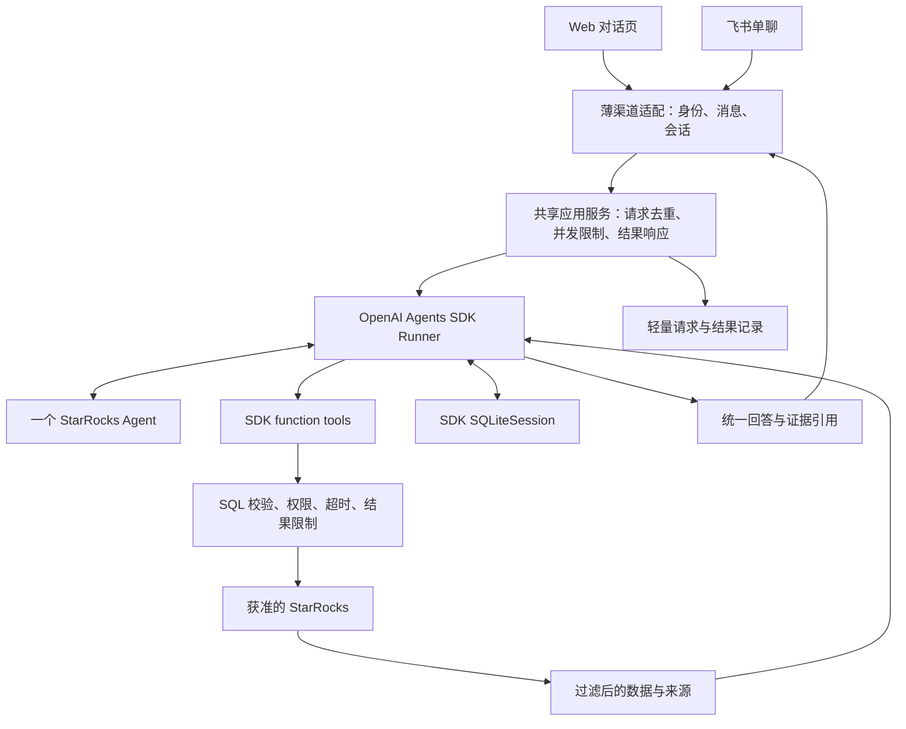

# 小维：基于 OpenAI Agents SDK 的产品设计

> 本文是新产品的书面设计草案。已确定方向是 SDK 原生开发、允许从零开始；首版同时支持 Web 与飞书对话。实现事实与待确认项见 [AGENT_HANDOFF.md](AGENT_HANDOFF.md)。

## 1. 产品目标

小维首版是 **StarRocks 数据库助手**，面向需要查数据、理解 SQL 和排查慢查询的运维与数据库工程师。查询助手和慢查询诊断使用同一 Agent、同一连接范围和同一渠道内的会话上下文。

典型对话：

1. “这个库有哪些表？订单表有哪些字段？”
2. “查一下昨天各状态的订单数，解释结果。”
3. “刚才这条 SQL 为什么慢？帮我看执行计划。”
4. “给出优化建议，说明依据和还缺什么证据。”

Agent 可以理解自然语言、生成 SQL、选择工具、根据工具结果继续调查。用户请求查询时，符合权限和查询限制的只读 SQL 可以直接执行；不能只生成建议，再要求用户到另一套产品完成所有操作。

首版的“诊断”是基于 SQL、元数据和普通 EXPLAIN 的分析与建议，不承诺仅凭执行计划确认真实慢查询根因。已有审计记录、Query Profile 可以提高诊断质量，按目标环境的实际可用性接入。

## 2. 最小范围与取舍

| 范围 | 首版做法 |
| --- | --- |
| 数据源 | 一个服务端配置的 StarRocks 连接，限定数据库、表或脱敏视图 |
| 查询 | 查元数据、生成或接收 SQL、校验后执行只读查询、解释有限结果 |
| 诊断 | 分析用户 SQL 或上一轮 SQL、普通 EXPLAIN、给出有依据的建议 |
| Web | 本机对话页；消息、执行提示、SQL、有限结果、诊断回答 |
| 飞书 | 获准用户与企业自建机器人的单聊；文本输入与文本回复 |
| 会话 | 同一入口可连续追问；Web 与飞书分别持有会话 |
| 运行 | 一个 Python 应用进程；SQLite 保存 SDK 会话和少量应用记录 |
| 暂缓 | 数据修改、配置变更、自动执行优化 SQL、导出、文件上传、群聊、跨渠道账号绑定、复杂工作台、多租户、多 Agent、后台任务平台 |

双入口采用共享应用服务：比只交付一个入口多两端联调，但能在同一版本满足实际使用。各渠道维护独立 Agent 会造成工具、规则和结果分叉，因此不采用。复用旧 Runtime 会使设计依赖旧计划与调度机制，也不采用。

Web 本机访问、飞书单聊、单连接是控制首版规模的设计默认值，不代表已经验证的部署能力。增加多人 Web 或公网服务时，必须先补适合该环境的身份与访问控制。

## 3. 架构与请求路径

SDK 负责模型与工具调用循环；应用负责接入、实际权限、领域工具和运行边界。应用直接调用 `Runner.run` 或 `Runner.run_streamed`，不解析模型文本自行调用工具，不创建通用计划编译器，不在 SDK 外面再运行一套 Agent 引擎。

这是 SDK 的原生用法：应用持有部署和工具，SDK 处理 Agent 循环。先使用一个职责清楚的 Agent，有实测收益再拆分。[OpenAI SDK 指南](https://developers.openai.com/api/docs/guides/agents/sdk)、[编排指南](https://developers.openai.com/api/docs/guides/agents/orchestration)。

## 4. SDK 能力如何落地

| SDK 能力 | 首版用途 |
| --- | --- |
| `Agent` / instructions | 定义数据库助手、澄清条件、工具选择与回答规范 |
| `Runner` | 唯一 Agent 循环；工具返回后继续推理或回答 |
| function tools | 把清晰的数据库操作暴露为类型化工具 |
| `RunContextWrapper` | 注入本轮可信身份、连接范围、客户端和预算；凭据不作为模型参数 |
| `SQLiteSession` | 本地跨轮会话；应用负责归属、保留周期和同会话并发限制 |
| `output_type` | 统一最终回答、实际证据引用和限制说明，渠道按需呈现 |
| guardrails | 辅助检查输入与输出；强制权限和 SQL 校验仍在工具 I/O 前执行 |
| tracing / usage | 开发观测和模型用量；显式控制敏感内容与外发 |

会话只选 SDK Session 一条历史管理路径，不同时自建聊天记录再手工回灌，也不与服务端 conversation continuation 重复叠加。流式执行先展示受控的进度事件，最终结构化回答完成并校验后发送；不把半截 JSON 或未校验结论直接当成回答。[运行与会话](https://developers.openai.com/api/docs/guides/agents/running-agents)、[结果](https://developers.openai.com/api/docs/guides/agents/results)。

首版没有写操作，不建设审批平台。有具体写场景后采用 SDK interruptions / RunState，并补动作绑定、权限复核与回读。handoffs、`Agent.as_tool()` 和 MCP 按实际需求启用。[Guardrails 与审批](https://developers.openai.com/api/docs/guides/agents/guardrails-approvals)。

## 5. 首版工具

下列名称是设计接口，尚非已实现 API。先实现前四项；后两项按真实环境能力增加，不以开通审计或更改目标配置作为前提。

| 工具 | 行为与边界 |
| --- | --- |
| `list_tables` | 列出授权数据库内允许访问的表或视图，不暴露整个实例目录 |
| `describe_table` | 读取获准对象的字段与相关结构；标识符由代码验证和安全引用 |
| `run_readonly_query` | 执行经过校验和限额处理的一条只读 SQL，返回实际 SQL、有限结果与来源 |
| `explain_query` | 对经过同等范围校验的只读 SQL 执行普通 EXPLAIN，不执行原始查询 |
| `list_slow_queries`（可选） | 查询已存在且获准访问的审计源；字段映射、窗口与脱敏按目标验证 |
| `get_query_profile`（可选） | 获取已有 query_id 的可用 Profile；不存在、已过期和无权限分别说明 |

“帮我诊断这条 SQL”不能自动转成执行该 SQL；先查元数据、执行计划和已有证据。优化后的 SQL 默认展示，用户明确要求执行时仍必须通过相同只读限制。

普通 EXPLAIN 与 EXPLAIN ANALYZE 是不同能力。后者实际执行语句，首版不开放自动调用。Profile 依赖环境版本、权限、采集与保留状态，空结果不能解释为查询健康。[EXPLAIN](https://docs.starrocks.io/docs/sql-reference/sql-statements/cluster-management/plan_profile/EXPLAIN/)、[EXPLAIN ANALYZE](https://docs.starrocks.io/docs/sql-reference/sql-statements/cluster-management/plan_profile/EXPLAIN_ANALYZE/)、[Query Profile](https://docs.starrocks.io/docs/sql-reference/sql-functions/utility-functions/get_query_profile/)。

## 6. 只读查询保护

模型生成 SQL 与用户提供 SQL 走同一条校验路径。首版支持范围受限的单条 SELECT，以及主体为合法 SELECT 的 WITH 查询；其他语句和无法可靠解析的方言语法默认拒绝，并给出原因。

- 使用真实只读数据库账号；SQL AST 校验、数据库权限和资源限制相互补充，不能只检查字符串是否以 SELECT 开头。
- 校验所有实际引用对象，包括子查询、CTE、跨库与 catalog 引用；禁止未授权对象、DDL/DML、多语句、导出、外部访问和未允许的函数。初始函数与语法范围在具体工具计划中列明并验证。
- 敏感数据优先通过脱敏视图或列级授权限制；禁止敏感列的策略还须覆盖过滤、连接和聚合推断，不能只把输出列擦掉。
- 连接与凭据只来自服务端；模型不能传任意地址、连接串、文件路径或账号切换参数。
- 限制输入、结果行数、字节数、字段长度和工具返回量；结果进入模型、Session、Web、飞书前完成相同过滤。
- 结果行数限制不等于扫描成本限制。使用目标端查询超时及可用资源约束，并设置客户端和整轮期限；目标端无法约束时不能开放不可控查询。
- 若工具为查询增加结果上限，必须展示实际执行 SQL 与截断信息，不把有限样本说成全量统计。
- 外部错误转成稳定错误类型与可操作说明，不直接回传连接细节、原始堆栈或敏感 SQL 字面量。

首版只允许事先确认可向模型及相应渠道展示的数据范围；通用正则脱敏不能保证任意业务表适合外发。数据库内容、注释与 Profile 都视为不可信数据，不能指挥 Agent 绕过权限。

## 7. 双入口的最小实现

### Web

FastAPI 提供同源 API 和简单 HTML/CSS/JavaScript 对话页，避免首版引入独立前端平台。支持发消息、执行中提示、显示回答、查看实际 SQL 与有限表格结果、新建会话。Web 内容按文本或经净化的 Markdown 展示，数据库返回值不得成为可执行 HTML。

默认仅绑定 loopback、供本机操作者使用；服务端固定身份，检查 Host/Origin，并使用不可猜测的会话凭证防止越权读取和跨站请求。数据库密钥和 OpenAI key 始终在服务端。不得直接把本机模式改成公网绑定就宣称可多人部署。

### 飞书

使用官方 Python 接入能力与企业自建机器人，优先长连接接收事件，不要求首版提供公网回调地址。先支持指定租户内获准用户单聊文本；其他用户、群聊、机器人自己的消息与不支持类型在入口处理，不交给模型决定是否允许。

事件处理快速完成验证、去重和有界任务接收，再异步运行 Agent、发送回复；不能等待完整模型回答才完成事件回调。事件重投按应用和消息标识去重；回复失败只重试发送已有结果，不重新查询数据库。消息过长截断或分段并保留限制说明，不为首版建设卡片系统。

官方接入文档存在包迁移，实施时以实际发布版本验证长连接、异步生命周期、去重和发送 API，再锁定依赖，不复制未经安装核对的旧 import。[飞书官方 Python SDK](https://github.com/larksuite/oapi-sdk-python/blob/v2_main/doc/channel.zh.md)。

### 共用与隔离

两端共用 Agent 定义、工具、查询保护和最终回答模型，渠道只处理身份、收发与展示。Session key 由服务端根据渠道与可信身份生成：飞书包含应用、租户、发送者和单聊上下文；Web 包含服务端操作者与浏览器会话。调用方不能指定任意 Session 读取别人的历史。

同一 Session 同时只运行一轮；繁忙时明确提示用户稍后再试。首次不跨渠道合并历史，也不把飞书身份自动等同于本机 Web 身份。

## 8. 最少的状态与可靠性

SDK Session 保存对话。应用另存少量请求和结果信息：渠道请求标识、归属、运行状态、时间、可重发的脱敏最终回答及工具来源。这些信息用于去重、失败提示和结果核对，不是另一套工作流或聊天历史引擎。

SQLite 使用本地持久目录；SDK 表与应用表各有所有者。会话和请求结果不假设跨表原子提交。进程重启后未完成请求明确标为中断；不自动重放模型或工具，也不承诺任意位置恢复。若 Session 已写入部分轮次且一致性无法确认，关闭该会话续跑并提示新建，不悄悄拼接历史。

请求完成以已校验的最终结果成功保存为准。飞书投递另记状态；发送结果不明不能假装用户已收到，也不能因此重跑 Agent。去重记录按保留策略清理，过旧事件拒绝，避免清理后重新执行旧消息。

应用使用受限的进程内并发、每会话互斥、外部 I/O 超时、SDK `max_turns`、工具次数与输出上限。`max_turns` 不是总工具数或硬费用上限。取消/超时不证明数据库端已经停止，报告实际状态并依靠数据库侧超时约束。

首版不引入 PostgreSQL、Redis、独立 Worker、lease/fencing 或分布式调度；出现多实例或可靠后台任务需求后再设计。

## 9. 输出、观测与数据

最终回答包含结论、实际使用的 SQL/来源、限制和建议。工具代码创建来源标识、目标、采集时间和截断标志；模型引用必须属于本轮实际取得的结果或当前会话中归属已验证且仍获准引用的历史结果。历史结果标明时间，不能当成刚刚重新采集。

模型可以给出疑似原因，不能把推断写成确认根因。工具错误、无数据和能力不可用必须分别表达。查询结果与诊断报告在两端信息一致，展示长度可以不同。

默认不采集敏感 trace 内容；真实业务数据场景默认关闭远程 trace 外发。仅在获准且脱敏的验证场景启用 SDK tracing；配置导出链时检查默认 exporter，不能只追加一个 processor 就认为阻止了原始外发。日志仅保留必要标识、时间、状态和用量。[SDK 可观测性](https://developers.openai.com/api/docs/guides/agents/integrations-observability)、[Python tracing](https://openai.github.io/openai-agents-python/tracing/)。

## 10. 工程组织与旧代码

以 Python 3.11 起步，具体 SDK、数据库驱动、SQL 解析库和飞书包必须安装核对后锁定。建议新应用使用独立的 `src/xiaowei/` 包，避免新入口意外装配旧 `xiaowei_agent` Runtime。首个切片同步调整打包与唯一主启动入口，不长期维护两套正式产品。

起步按职责设置少量文件：配置、Agent 定义、应用服务、StarRocks 工具与 SQL 校验、Web 与飞书入口、轻量存储、静态页面。只有文件复杂度需要时再拆包；不预生成多层框架。

旧代码不是保留清单。参数处理、SQL 样本、脱敏函数、错误样本等只有在当前切片确实有价值且成本低于重写时才迁入；旧 Runtime、Resolver、PlanCompiler、Worker 与 TaskStore 不进入新应用的默认设计。历史由 Git 保留，源码清理列明范围并保护用户数据。

## 11. 验收边界

- Web 与飞书都通过同一应用服务进入真 SDK Runner；工具返回后确有下一轮执行。
- 两端均能查结构、执行获准只读查询、解释结果、分析 SQL 的普通执行计划并连续追问。
- SDK Session 隔离成立；飞书重复消息不会重复运行 Agent 或数据库查询。
- 未授权用户/对象、危险 SQL、外部文本注入、超限、超时与渠道发送失败有对应结果。
- 正式浏览器、真实飞书消息、真实模型和获准 StarRocks 环境分别留证，fake 测试不替代这些证据。
- 没有 Profile 时能说明诊断限制；没有真实慢查询来源时不能展示虚构的历史慢查询列表。

实施顺序见 [DEVELOPMENT_PLAN.md](DEVELOPMENT_PLAN.md)。设计写完不等于 SDK 产品已经运行，也不等于负责人已接受书面设计。
