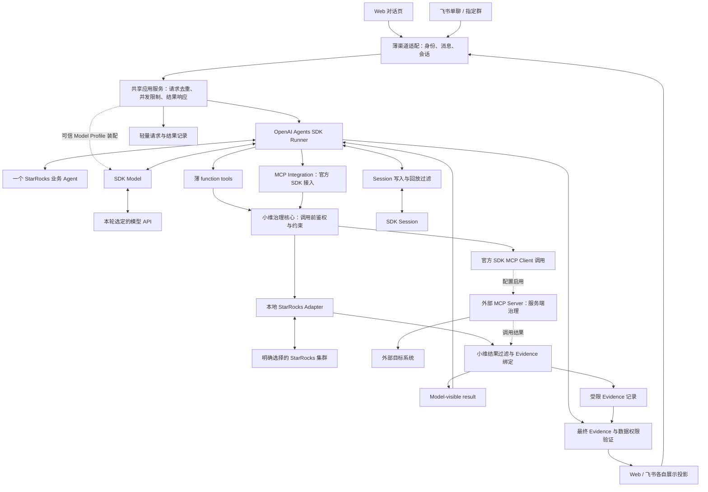

# 小维：基于 OpenAI Agents SDK 的产品设计

> 产品方向已确认：SDK 原生开发；P1–P3 的 StarRocks 助手支持 Web、飞书与最小 MCP Client Integration。监控增量的产品与权限边界见 §5「监控接入」，实施顺序另见计划。实现事实见 [AGENT_HANDOFF.md](AGENT_HANDOFF.md)。

**OpenAI Agents SDK 负责 Agent Loop；小维负责权限、受治理工具执行、证据真实性和数据边界。**

这是最高架构原则。SDK 保留运行循环的所有权；下述治理、数据和证据检查由确定性应用代码落实。**MCP 是标准化工具接入机制，不能替代小维的业务授权与数据边界。**

本文区分三类约定，避免把设计伪代码当成 SDK 已验证能力：

| 类别 | 内容 | 实施时如何处理 |
| --- | --- | --- |
| 已确定的产品与边界 | SDK 核心、查询与诊断、Web/飞书、最小 MCP 接入、只读与治理边界 | 实现必须满足；不能在局部改动中暗改范围或放宽权限 |
| 首版实现选择 | 单业务 Agent/单进程、本机 Web、SQLAlchemySession + PostgreSQL、Docker Compose、静态模型配置、非流式运行 | 按此起步；有实际约束时说明证据并更新设计，不预建多套方案 |
| 锁版与联调后确定 | SDK 方法签名、包装扩展点、模型兼容组合、目标版本与依赖 | 先做最小验证，再落实代码；文档中出现名称不代表接口已经可用 |

`Model Profile` 指模型服务配置，`Query Profile` 指 StarRocks 查询执行信息；两者不是同一对象。开发协作见 [AGENTS.md](AGENTS.md)，当前状态只在 [AGENT_HANDOFF.md](AGENT_HANDOFF.md) 维护。

## 1. 产品目标

小维首版是 **StarRocks 数据库助手**，面向公司内部需要查数据、理解 SQL 和排查慢查询的 DBA、数据开发、运维、业务及运营人员。查询助手和慢查询诊断使用同一 Agent、同一连接范围和同一渠道内的会话上下文。

典型对话：

1. “这个库有哪些表？订单表有哪些字段？”
2. “查一下昨天各状态的订单数，解释结果。”
3. “刚才这条 SQL 为什么慢？帮我看执行计划。”
4. “给出优化建议，说明依据和还缺什么证据。”

Agent 可以理解自然语言、生成 SQL、选择工具、根据工具结果继续调查。用户明确请求查询且必要信息齐全时，符合权限、SQLGuard 和资源限制的只读 SQL 可以执行（P2.5 的单 Agent 自然语言工具选择见 §5；当前显式入口实现见 handoff）；不能只生成建议，再要求用户到另一套产品完成所有操作。

首版的“诊断”是基于 SQL、元数据、表布局、固定显式级别的执行计划（`EXPLAIN LOGICAL`，不执行原查询）与已有审计记录的分析与建议，不承诺仅凭执行计划确认真实慢查询根因。审计记录来自目标上已有的 AuditLoader 审计表（P2 已实现，审计源未配置时不提供）；Query Profile 暂不接入。

## 2. 最小范围与取舍

| 范围 | 首版做法 |
| --- | --- |
| 数据源 | P2 已实现单目标直连与手写表列范围；P2.5 继续本地 Adapter 直连，支持多个 StarRocks 目标，数据范围改为只读账号实际 SELECT 权限（§6） |
| 查询 | 查元数据、生成或接收 SQL、校验后执行只读查询、解释有限结果 |
| 诊断 | 分析用户 SQL、上一轮 SQL 或审计表中的慢查询；取执行计划（`EXPLAIN LOGICAL`）与表布局，给出有依据的建议 |
| Web | 对话页，显示消息、执行提示、SQL、有限结果与诊断回答；原生入口默认只监听本机，Compose 部署默认发布到宿主机所有地址供公司内网访问（§10 Web 绑定），无登录、共用 `operator_id` |
| 飞书 | 保留获准单聊；P2.5 后、P3 前增加一个指定群，@ 才触发，全员同权、群内共享上下文与结果（§7） |
| 会话 | 同一入口可连续追问；Web 与飞书分别持有会话 |
| 工具接入 | StarRocks 走受治理 function tools 与本地 Adapter；通用 MCP Client Integration 保留用于其他能力，数据库 MCP 暂缓（§5） |
| 运行 | Docker Compose 管理一个小维应用容器和一个 PostgreSQL 容器；应用单进程，SDK Session 使用 SQLAlchemySession，应用记录独立存储；飞书优先长连接 |
| P1–P3 暂缓 | StarRocks 写操作、自动执行优化建议、导出、文件上传、多群管理、跨渠道账号绑定、多人公网 Web、多租户、多 Agent 协作、后台任务平台、数据库 MCP、TiDB/MySQL；监控增量单独规划于 §5，不视为已实现 |

双入口采用共享应用服务：比只交付一个入口多两端联调，但能在同一版本满足实际使用。各渠道维护独立 Agent 会造成工具、规则和结果分叉，因此不采用。复用旧 Runtime 会使设计依赖旧计划与调度机制，也不采用。

Web 本机访问、飞书单聊、P2 及之前的单连接是控制首版规模的设计默认值，不代表已经验证的部署能力。增加多人 Web 或公网服务时，必须先补适合该环境的身份与访问控制。

## 3. 架构与请求路径

图为含已批准增量的设计路径，当前实现进度见 handoff。MCP Client Integration 与 Web/飞书共享同一个后端；正式 `serve` 目前尚未装配外部 MCP Server，监控增量将按 §5 接入。小维仓库不内嵌业务 Server，数据库 MCP 暂缓，StarRocks 的本地路径继续不依赖 MCP 可用性。启用远端工具时，请求先经过小维治理，远端自身仍须鉴权并约束实际执行。

SDK 负责模型与工具调用循环；应用负责接入、实际权限、领域工具和运行边界。首版直接调用非流式 `Runner.run`，不解析模型文本自行调用工具，不创建通用计划编译器，不在 SDK 外面再运行一套 Agent 引擎。渠道的“处理中”等状态提示由应用生成，不依赖模型文本流。

这是 SDK 的原生用法：应用持有部署和工具，SDK 处理 Agent 循环。先使用一个职责清楚的 Agent，有实测收益再拆分。[OpenAI SDK 指南](https://developers.openai.com/api/docs/guides/agents/sdk)、[编排指南](https://developers.openai.com/api/docs/guides/agents/orchestration)。

## 4. SDK 能力如何落地

| SDK 能力 | 首版用途 |
| --- | --- |
| `Agent` / instructions | 定义数据库助手、澄清条件、工具选择与回答规范 |
| `Runner` | 唯一 Agent 循环；工具返回后继续推理或回答 |
| SDK `Model` / provider | 接入明确配置的 OpenAI、Gemini、DeepSeek、Vertex AI 或经验证的兼容端点；不改变运行引擎 |
| function tools | 本地业务的薄入口；转换参数并调用 Governed Tool Service |
| SDK MCP integration | 复用官方连接、发现与调用能力；小维装配可信配置、工具过滤、调用前治理与结果过滤 |
| `RunContextWrapper` | 只承载可信身份、Target Scope、Tool Scope、预算及 Evidence 标识/元数据 |
| SDK `Session` | 会话接口；首版存储采用 `SQLAlchemySession + PostgreSQL`，独立落实写入/回放的数据策略与访问限制 |
| `output_type` | 约束最终回答结构；Evidence 真实性、归属和权限另由代码验证 |
| guardrails | 辅助检查输入与输出；强制权限和 SQL 校验仍在工具 I/O 前执行 |
| tracing / usage | 生产默认关闭 tracing 与外发；保留不含内容的状态、耗时和用量统计 |

SDK Session 继续使用 SDK 公共 Session 接口；首版正式持久化后端采用 SQLAlchemySession + PostgreSQL。应用状态与 SDK Session 共用 PostgreSQL 实例，但保持数据所有权和表结构边界独立；不预建多后端框架。官方 SQLAlchemySession 支持 PostgreSQL 与异步驱动，实际扩展点仍须按锁定版本验证。[官方 SQLAlchemySession 文档](https://openai.github.io/openai-agents-python/sessions/sqlalchemy_session/)。

小维的 RunContext 是可信执行范围，不是依赖容器：Target Scope 仅含服务端目标标识与允许资源，Tool Scope 仅含允许操作；Evidence 信息限引用和必要元数据，不装原始结果、任意对象或服务定位器。密码、API key、连接串、DB connection、数据库/模型客户端及可间接取得这些对象的服务引用均不得进入 context。客户端由应用在装配时注入治理服务与 Adapter，工具只闭包捕获治理服务。SDK 本身允许本地 context 携带依赖且不自动传给模型；这里采用的是小维更严格的应用约定，不能误称 SDK 限制。[Agent 定义与本地 context](https://developers.openai.com/api/docs/guides/agents/define-agents)。

会话只选 SDK Session 一条历史管理路径，不同时自建聊天记录再手工回灌，也不与服务端 conversation continuation 重复叠加。后续确需流式执行时再验证 `Runner.run_streamed`；最终结构化回答完成并校验后发送，不把半截 JSON 或未校验结论直接当成回答。[运行与会话](https://developers.openai.com/api/docs/guides/agents/running-agents)、[结果](https://developers.openai.com/api/docs/guides/agents/results)。

P1–P3 没有业务写操作。监控增量的首批写动作见 §5；优先用锁定 SDK 的 interruptions / RunState，必须先证明跨进程审批恢复与现有 `PolicySession`、Evidence 和飞书群队列兼容，才能开放写工具。未知风险或未经选择的 MCP 写工具继续隐藏。不建设通用审批平台。handoffs 与 `Agent.as_tool()` 按实际需求启用。[Guardrails 与审批](https://developers.openai.com/api/docs/guides/agents/guardrails-approvals)。

### 模型 API：多服务配置，单模型运行

**以 OpenAI Agents SDK 为核心，不等于只使用 OpenAI 模型。** 首版接入目标包含 OpenAI、Gemini、DeepSeek 与 Vertex AI（API Key 模式），使用 SDK 公开 `Model` / provider 接口装配实际模型调用；Vertex 原生协议由本仓库对公开 `Model` 的薄适配接入，不引入供应商 SDK 的工具循环。应用维护少量可信配置与必要协议适配，不自建 LLM Gateway、模型路由框架或另一套 Agent Loop；Gemini/DeepSeek 的自动工具执行循环不进入本产品。[SDK 模型与 provider](https://developers.openai.com/api/docs/guides/agents/models)。

| 接入目标 | 首条验证路径 | 开放条件 |
| --- | --- | --- |
| OpenAI | SDK 原生 Responses 模型接入 | 明确模型 ID，并验证工具调用、结构化输出与本地 Session |
| Gemini | SDK Chat Completions 模型接入 Google 的 OpenAI 兼容端点 | 按具体模型验证 tools、输出 schema、后续轮次及所需协议字段 |
| DeepSeek | SDK Chat Completions 模型接入其兼容端点 | 核对工具参数、JSON 输出与推理模式的组合；其他协议另行验证 |
| Vertex AI（API Key 模式） | 本仓库对 SDK 公开 `Model` 的非流式适配，固定 `v1beta1` `generateContent` 端点与协议；同一请求携带函数声明与供应商结构化输出约束 | 已有协议替身下的离线验证；锁定模型上的真实工具往返、结构化输出与跨轮签名回放验证前不开放 |
| 第三方/企业网关 | 上述协议中网关实际支持的一种 | 单独验证该端点、模型和参数组合；不能继承直连厂商的通过结论 |

Google 与 DeepSeek 均提供 OpenAI 兼容调用方式；这只说明存在接入路径，不代表与 SDK 的全部功能等价。Google 的兼容文档仍标示 beta；DeepSeek 的 JSON Output 使用 `json_object`，不能将合法 JSON 等同于严格满足最终回答 schema。[Gemini 兼容接口](https://ai.google.dev/gemini-api/docs/openai)、[DeepSeek 接入](https://api-docs.deepseek.com/)、[DeepSeek JSON Output](https://api-docs.deepseek.com/guides/json_mode/)。

首版用静态 Model Profile 保存 `profile_id`、供应商标识、明确模型 ID、凭据安全引用、请求期限、输出 token/请求与响应字节上限、数据接收策略标识及获准模型参数。OpenAI 协议族（OpenAI、Gemini、DeepSeek 与兼容端点）另由配置保存固定 `base_url`、API 协议和输出模式；Vertex 必须省略这三项，端点、协议与结构化输出方式由可信代码固定，固定身份计入 Profile 指纹，填写即拒绝。配置项服务于已验证组合，不提供任意 `extra_body`/headers 透传。凭据只在应用装配时解析；每个客户端独立绑定端点和凭据，不进入 RunContext、Session、浏览器、日志或 trace。端点和模型不能由对话内容改写，不通过修改全局客户端在用户间切换。

配置可以登记多家服务，部署时选择一个活动 Profile；一次运行只用这一个模型。首版更换供应商、端点、协议或模型时开启新会话，不迁移旧历史，不自动跨厂商 fallback。会话元数据绑定不含凭据的 Profile 版本；旧 Session 的数据授权不会因配置切换自动扩展到新接收方。模型数据外发权限绑定实际端点与接收方，使用第三方网关也须明确其接收权限。关闭 tracing 不等于模型 API 不接收请求，也不代替供应商存储/保留策略的确认。

最终结果继续使用 `output_type` / Pydantic 的结构校验，再进入 Evidence 验证。`json_schema` 与 `json_object` 的区别限定在 API 请求编码层；仅支持 JSON mode 的组合必须通过 SDK 公共设置或薄 `Model` 适配保留同一最终类型校验，空内容、截断或不合 schema 的结果不能交付。不能静默关闭结构化输出、正则提取模型文本自行调工具、使用私有 API 或复制运行循环来宣称兼容。无法满足必要契约的组合保持未启用，并记录具体限制。

首版先用非流式 `Runner.run` 完成模型工具闭环，渠道仍可展示受控状态提示。Vertex 的 Gemini 3 响应允许同一步返回多个函数调用：锁定 SDK Runner 将各调用交给受治理工具，应用用公开 `ToolExecutionConfig` 把同轮函数工具并发限制为 4；每次调用仍独立复核权限、参数、目标与预算，StarRocks 每目标连接数另受其 `pool_size` 限制。回传给 Vertex 时，同一步的函数调用及其结果分别组成连续的 `parts`，第一个调用的 `thoughtSignature` 原位保留；混合响应中的文本不进入 Session 或交付。这些形态已有 SDK/协议替身离线验证，真实 Vertex 仍须实测。流式模型输出和厂商特有推理参数须另行验证；其他供应商的多调用行为也须按具体端点与模型取得真实证据，不继承 Vertex 的结论。若某模式必须保留厂商协议字段才能继续工具调用，还需验证 Session 数据策略能够安全保存与回放；两者不能兼容时不启用该模式。

调用具备请求超时、整轮期限、并发和输入输出上限。首版显式关闭模型 HTTP 客户端自动重试，401/403、429、超时和服务端错误返回受控失败；不因模型失败重跑整个 Runner 或重复已执行工具。后续确需重试时只在模型请求层增加经测试的有限策略。记录 Profile/模型、状态、耗时和可取得的 usage；用量缺失标为未知，费用估算不冒充硬费用上限。

验收按“SDK 版本 + 端点 + 协议 + 模型 + 参数配置”留证：真 Runner 完成工具调用、结果回传、结构化最终回答、Evidence 校验与 Session 追问；验证鉴权/限流/超时、非法输出、凭据隔离和默认无 trace 外发。OpenAI、Gemini、DeepSeek、Vertex 分别记录未验证/通过/不兼容，至少先完成一个实际可用 Profile；只通过某家不能宣称其他几家可用。Vertex 目前只有协议替身下的离线证据，锁定模型上的真实验证通过前不开放。首个实测模型和端点在实施联调时根据获准配置确定。

### 生产变更：Action 与用户确认

获准的生产写操作统一按 **Action：一次目标明确、参数明确、效果可判断的业务操作**描述，不局限于 SQL。这里的生产写操作指改变生产目标状态的业务动作，不包括 Session 等应用内部的正常持久化。统一的是动作描述、授权与审批契约，具体执行仍由受治理的业务工具承担，SDK 保持 Agent Loop 所有权；本轮只批准 §5 列明的监控动作，其他动作另行决定。

以下四条为架构约束：

1. **Model intent ≠ execution authority。** 模型可以提出候选动作和参数，不能授予执行权限；对架构方案的认可、历史对话和笼统的优化请求都不是具体生产动作的批准。
2. **Tool effect/risk 由可信代码定义。** effect 描述操作会改变什么，risk 结合参数、目标和环境判断风险；两者不能混为“只读就低风险”。模型判断和远端 MCP annotations 不能自行授予能力，效果或风险无法确认的工具不开放。
3. **Diagnose/read 不能自动升级为 write。** 诊断可以提出改动建议，但不能据此自动建索引、改配置、取消查询或重启服务。
4. **所有生产 write 都重新经过 Policy / Approval / Action Binding。** 每次实际执行前都复核当前权限、有效审批和动作绑定；审批不能覆盖 Policy 拒绝，历史查询权限不能继承为写权限。

**所有生产写操作必须先取得有审批权限的用户明确确认，才能执行。** 先向用户展示具体目标、规范化参数或最终 SQL、预期改动与影响，再确认该动作。模型判断、默认同意、历史“确认”、无人回应或超时都不能代替本次明确确认。

Action Binding 将批准绑定到代码生成的动作标识、申请人和审批人、生产目标、规范化参数、工具契约版本、关键执行前提、有效期及一次执行机会。确认后若目标、参数、契约或关键前提变化，或批准已过期，必须重新展示并确认；权限被撤销则拒绝执行。发送确认提示时不能暴露凭据或用户无权查看的数据。

执行顺序为：**提出候选动作 → Policy 校验并形成确定动作 → 展示内容与影响 → 有权限用户确认 → 复核当前 Policy、Approval 和 Action Binding → 执行一次 → 回读并记录 Evidence**。SDK 原生审批负责暂停与恢复，小维负责可信身份、动作绑定、一次执行机会和执行前复核；群内等人确认不得长期占用 Agent 运行或群队列。不能将一次确认扩大为对某工具后续调用的永久批准。结果不明时记录未知状态并先核实，不自动重复执行；调用返回成功也不能代替目标状态回读。

P1–P3 仍不暴露业务写工具；监控写工具只有满足 §5 的群审批与协议验收后才启用。未实现或未开放的操作即使用户确认也不能执行；只为已选监控动作实现必要状态，不提前建设通用 Action 执行框架。

## 5. 动态工具与受治理执行

每轮调用 SDK 前，应用按可信身份、Target Scope、Tool Scope 与已确认的环境能力构造本轮工具集合。例如审计源未配置时不登记、不暴露 `list_slow_queries`（配置开放它会在启动时被拒绝）。未确认可用的能力不默认开放；相关工具说明和动态 instructions 同步收窄。直接使用 SDK 的工具配置能力，不建设新 Resolver 或能力 DSL，不并发修改共享 Agent 的工具列表。

**本轮意图（用户 2026-10-03 修订，P2.5 Task 7 实现）。** 只保留一个持有业务工具和 Session 的 Agent，由 SDK Runner 驱动；取消无工具的前置用途识别。查询工具按当前身份、目标能力和模型数据策略向获准用户开放，模型在同一轮根据自然语言决定是否调用。明确查询且集群、口径、时间等必要信息齐全时才调用；只解释、只写 SQL、明确“不要执行”或意图不清时不调用查询工具，先完成解释/建议或澄清。裸 SQL 不默认表示要求执行；历史、其他成员的指令与工具返回不是当前用户的查询要求。

这是用户选择的 Agent 行为方式，不是确定性意图安全关卡。自然语言诊断或模糊消息不会先经分类器隐藏查询工具；模型误选工具后，只读账号、SQLGuard、当前权限和资源限额仍强制执行，但它们不能判断用户是否想查询。固定反例在 P3 用真实模型评估误执行，离线预设模型只能证明调用链，不能声称所有诊断自然语言都已由代码保证零执行。诊断工具自身始终只取明确 LOGICAL 计划，不执行被诊断 SQL。

保留 Web 显式诊断和飞书 `/诊断` 作为可选收窄入口：可信入口选择后隐藏并拒绝实际查询工具，不依赖模型自报意图；普通消息默认由单 Agent 判断。`/查询` 不跳过必要信息、权限或资源限制，正文明确禁止执行时模型仍应停止。Task 7 起 Web 与飞书普通消息即默认用途（`query`），原“普通消息默认诊断”不再保留；API/CLI 仍须显式给出用途。不增加第二次分类请求、用途识别 Session、handoff 或意图路由平台。

工具可见性只回答“这轮可以考虑什么”；调用时必须再回答“当前参数和具体资源是否仍获准”。权限撤销、环境变动或参数越界时，Governed Tool Layer 在 I/O 前拒绝。无法事先得知的临时故障仍需正常报告，不能承诺隐藏工具能消除所有运行错误。

本地路径是 **function tool → Governed Tool Service → StarRocks Adapter**；远端路径是 **MCP Integration → 小维调用前治理 → SDK MCP Client → 外部 MCP Server**。返回结果均先经小维过滤和 Evidence 绑定，再交给 SDK。共享的是身份/目标授权、预算、结果策略与证据验证；SQLGuard 只用于适用的 SQL 工具，不能声称客户端能约束未知远端实现内部的全部行为。

本地治理服务使用稳定的类型化 request/response，SDK 装饰函数只转换参数和调用。领域逻辑不依赖 MCP 报文或 SDK context 类型。数据库能力改走外部 MCP Server 后，领域校验（SQLGuard、范围与上限）仍在小维执行；外部 Server 不假定复用小维代码，必须按接入约定独立核查认证、目标绑定、执行限制与返回契约。Adapter 负责协议、连接生命周期和有界 I/O，不替模型作决策。

治理层首版是共享的少量函数或服务方法，工具只调用对应的受治理方法；不另建通用工作流、调度器或第二套 Agent Loop。凭据只在应用私有配置和 Adapter 生命周期内使用，错误及日志不得携出。最终 Evidence 发送验证是独立的输出关口，不能用执行成功替代。

### 最小 MCP Client Integration

首版由 SDK 官方接入对象承担协议工作，小维只做薄的配置与治理装配。不自研 MCP 协议，不建设通用 Gateway、DSL、插件市场或配置管理平台，也不按领域分别实现 Client。

| 职责 | 首版边界 |
| --- | --- |
| Server Registry | 静态可信配置：server_id、固定端点、启用状态、认证引用、超时、tool allowlist 和治理映射；默认空集合 |
| Connection Lifecycle | 官方 SDK 管理连接与关闭，小维设置期限、受限并发和可用状态；一个 Server 失败不阻断本地工具，不无界重连 |
| Discovery / Filtering | 以 server_id + tool name 标识工具，核对输入/输出契约、风险和权限后才暴露；未知工具、重名冲突、未接受的 schema 变化默认拒绝 |
| Trust / Auth | 配置和认证材料仅在应用装配层持有，不进 RunContext；服务凭据不自动代表最终用户授权，按身份和目标范围限制每次调用 |
| Policy Mapping | 绑定已支持的参数含义、目标选择、只读风险与结果投影；没有映射就不开放，不能由模型或远端 annotations 自行批准 |
| Call / Result Boundary | 每次请求发出前复核权限、参数与预算；结果进入模型前限制类型、字段、大小并建立本地 Evidence |

首版先验证一条 transport，具体选择在当前实施计划中固定；其他 transport 和认证流程按真实消费者需求增加。Hosted MCP 不作为首版默认接入路径，避免把“运行时可过滤结果”的设计无验证地套到托管调用路径上。官方区分由平台调用的 hosted MCP 和运行时直接连接的 stdio/Streamable HTTP；两者的过滤位置与网络边界不同。[SDK MCP 接入](https://developers.openai.com/api/docs/guides/agents/integrations-observability)。

MCP Integration 的治理必须覆盖实际发送动作，不能只过滤 `list_tools` 或在响应后检查。不要直接把未经治理的 SDK MCP Server 对象挂到 Agent 上；也不要假定 function tool guardrails 自动覆盖 MCP。实现时先验证所锁定 SDK 的公开扩展点可拦截调用与结果，不能以私有 API、源码 monkey patch 或自研 Agent Loop 绕过限制。[Guardrails 的执行范围](https://developers.openai.com/api/docs/guides/agents/guardrails-approvals)。

对已经支持的认证、参数与结果契约，增加 Server 应主要修改配置；新领域语义、风险或返回格式仍可能需要新的策略/转换代码。一个 Server 可以有多个连接实例，但共享缓存或连接不得串用不同用户的权限和凭据。远端可接收的输入也受限制，不能把本地身份、会话历史、预算对象整体序列化转发。

配置为空时不建立连接、不增加产品启动依赖；启用后必须具备真实协议级验证。测试可启动只服务合成数据的临时 MCP fixture，它不属于产品部署或业务 MCP Server。未来服务按领域、权限、网络、凭据和部署生命周期拆分，当前不预设数量。

### 监控接入：Prometheus、Grafana 与独立 Alertmanager（已批准设计，尚未实现）

**范围与部署。** 沿用一个 SDK Agent、Web/飞书薄入口、静态 MCP 连接、受治理工具与 Evidence。监控 MCP Server 在小维服务器节点之外独立部署和维护；小维只配置固定远端 HTTPS 地址、认证引用、获准工具及监控源权限，不在本机 Compose 中增设 MCP 容器或代管其生命周期。Prometheus 和 Grafana 优先使用各自官方 MCP Server；独立 Prometheus Alertmanager 先验证社区 MCP Server，若其协议、安全或维护条件不满足，只为外部 Alertmanager API v2 实现薄本地 Adapter，不自建业务 MCP Server。Server 版本、所选工具的真实输入/输出、认证与部署方式须先锁版验证；远端工具目录不能直接整体交给模型。StarRocks 路径及 P3 验收范围不因监控规划自动改变。

**Agent 自主调查。** 用户提出问题后，同一个 Agent 自行决定是否查、先查哪一源、如何发现指标/标签、怎样组合 PromQL、是否根据中途证据继续查其他源或向用户澄清；没有规定的“Prometheus → Grafana → Alertmanager”步骤，也不按预置指标模板或固定诊断工作流运行。确定性治理只在工具可见性、每次 I/O 前的源/参数/预算边界、结果/Evidence 和生产写批准处生效，不替 Agent 编排调查。实施切片的先后是开发依赖，不是用户请求的运行顺序。

**监控源权限。** Prometheus、Grafana、Alertmanager 分别有可信目标 ID、固定端点及独立的读/写授权；组织/租户也由可信配置固定，模型参数或请求头不能切换。授权按监控源共享，获准者可调查该源可见的全部主机、指标、告警和 Grafana 对象，不另设主机名、指标/PromQL 模板、Dashboard UID、文件夹或数据源对象白名单。Web 的共用 `operator_id` 与飞书单聊仅用于已授权的读取/调查；指定飞书群按真实 `chat_id`、成员 `open_id` 和每个监控源的群读授权接入。服务账号在远端能访问的范围、Grafana 组织权限与网络出口必须与这份共享授权相符；不能把共享凭据当作飞书用户身份。Grafana 读取 Dashboard/Panel 定义不自动允许查询其引用的其他数据源：实时数据走已授权的 Prometheus 源，Grafana 代理查询只有能绑定到已授权源并满足同等资源限制时才开放；否则只展示定义并标明未核实实时状态。首次发送、历史、重发及会话回放均重新检查当前源与接收权限；无法可靠验证的历史内容拒绝交付，历史快照不冒充现状。

静态配置改权须先停止或排空旧进程、再以新配置启动；既有 §9 对旧进程已开始轮次的残余窗口仍适用，不能把“每次调用复核”写成跨进程即时撤权。审批等待期间若要撤权，应先停用相应写源或进程，再变更配置；恢复后的执行前必须按新配置重新检查。

**读取与资源。** Agent 可以发现指标、标签、目标、告警及已加载的原生规则，自行写 PromQL，并结合 Grafana Dashboard、独立 Alertmanager 的告警/静默调查。只读权限仍受工具/源/渠道、调用次数与期限、四种数据投影限制。范围查询的起止时间、步长、点数与表达式长度在网络请求前检查；Prometheus 服务端还须实际启用查询超时、样本数与并发限制，因表达式内部回看窗口和高基数扫描不能只由 API 时间范围限制。超时、鉴权失败、结果不明、协议变化和截断不得当作健康。仅明确识别为 PromQL 语法/表达式错误且上游返回可安全展示的有限错误类别时，允许 Agent 在同轮有界修正；错误调用计入预算、不生成成功 Evidence，其他执行后失败仍终止。warnings、部分结果、采样/投影截断与空结果分别标记，不推论全量正常。

**首批写动作。** 仅在指定飞书群开放：Alertmanager 创建静默、按静默 ID **取消静默（提前结束）**；Grafana 创建/修改 Dashboard、创建/修改数据源的非秘密字段、创建 Annotation。取消静默是首批独立的运维动作，同样逐次群审批、执行后回读，不因“普通删除暂不做”而排除。操作范围为已授权监控源内、共享服务账号所在组织可见的对象，不设对象白名单；未经逐项选择的上游写工具仍隐藏。静默可选择 1 年、3 年或明确到期的自定义多年时长，必须有有限 `endsAt`，不称“永久”，不建自动续期。当前不做普通删除、Prometheus 历史数据删除、Prometheus reload/quit、Grafana 托管告警规则写入、原生规则文件修改/发布、安装插件或任意上游写工具；规则文件在另一宿主机，后续单独扩展。只读工具不能借 Grafana 的代理查询或带副作用的 API 绕过写审批。

**群审批与执行。** 群成员可提出候选动作；仅配置名单中的群成员可批准，同一申请人若在名单中可自行批准。Web、飞书单聊与其他群不能申请、审批或执行。一次申请在群里展示源/对象、规范化参数、动作差异、影响、期限、回退办法及不含秘密的版本/前提；用飞书事件中的真实 `open_id` 核对审批人，不以模型文字或群共享 Session 判断身份。批准绑定唯一 Action、群、申请/审批人、目标、参数、工具契约、目标版本、有效期和一次执行机会；重复事件、过期、权限撤销、版本/参数变化均在远端 I/O 前拒绝。待审批与执行/未知状态持久化到已有 PostgreSQL 应用表，不让 Runner 或群队列一直等待确认；重启后绝不自动补跑写请求。确认后仍须按 §4 复核、执行一次、回读；未知结果先人工或只读核实。Approval 与 Action Binding 的跨进程恢复先通过锁定 SDK 的公开 API 验证，不能靠模型续写文本或放宽 `PolicySession` 数据边界蒙混。

**写结果、补偿与凭据。** Dashboard 更新须显示差异并检查当前版本冲突，成功后回读 UID/版本/内容；必要时以另一次获批准的更新恢复前版。新建 Dashboard、数据源或 Annotation 若需删除才能撤销，首批不提供自动删除工具，交给 Grafana 管理员按 UID/ID 人工恢复，记录执行人及结果，不承诺自动回滚。新建静默可通过另一次获批准的取消静默动作撤销；取消后若需重新静默，则提交新申请。数据源创建/修改只接受经锁版验证的非秘密字段，连接地址及变更在群里完整展示；密码、Token 和 `secureJsonData` 不进群、模型、Action 或 Evidence。需要凭据时群里显示“待配置凭据”与 Grafana 设置入口，由有权用户在 Grafana UI 填写；健康检查通过前不标记为可用。Grafana 服务账号的组织权限和网络出口须防止新数据源连接到未经批准的敏感地址。恢复动作同样有独立审批或人工运维记录。

数据源修改在批准前及执行前须回读当前配置并绑定其摘要；若目标 API 不能原子拒绝并发管理员修改，应在隔离环境实测竞争窗口，并在生产启用前明确接受或改变该边界，不能声称前后两次回读等于原子版本控制。

**证据与回答。** 成功监控查询的 Evidence 除已有来源/归属外，保存并可按接收策略展示规范化的实际 PromQL、监控源、求值时刻、范围/步长、采集时刻、结果完整性标记及必要的最小事实；不只留参数摘要，也不保存原始指标全集。Dashboard 定义、Alertmanager 告警状态与实时指标分别标来源和时间；历史内容有当前权限复核但仍是旧快照。写 Action 的申请、批准、执行尝试、回读及未知/补偿状态分别留可信记录，不用模型结论或 MCP 成功字样冒充目标已变更。

### 数据库能力 MCP 化（暂缓）

用户 2026-10-02 决定数据库执行继续本地 Adapter 直连；2026-10-03 确认 P2.5 与群聊增量均在 P3 前完成。直连已经承载 P2 执行约束，MCP 不减少方言、EXPLAIN、限额和审计源的数据库特有工作，还增加协议、运维和逐版本验收成本；当前一人加 AI 维护，先减少组件。

保留“治理在小维、执行端可替换”：`SDK FunctionTool → GovernedTools / SQLGuard → 本地 Adapter（设置并回读会话限额，有界执行）→ StarRocks`。只读账号、会话限额设置与回读、有界读取、固定 EXPLAIN、错误过滤和连接关闭仍由 Adapter 实施。小维仓库不内嵌数据库 Server；将来启用 MCP 时由外部独立维护，连接级保证须由 Server 实现并重新验收，不能自动继承。[接入约定](docs/contracts/database-mcp-server.md) 保留为暂缓草案。

重新评估条件：出现可验证的独立部署/多客户端共享需求、成熟 Server 明确减少维护成本，且有责任方、版本与验收证据；届时单独决策。通用 MCP Client Integration 保留，监控增量按上节单独接入。当前正式入口无 `mcp` 段、静态 Bearer/启动发现/不自动重连等限制仍是通用 MCP 接入事实，不构成数据库阶段前提。

### 首版 StarRocks 工具

下表记录 P1-B/P2 当前工具契约；P2.5 的目标差异由 §6 与实施计划定义，不能把目标当作已实现。下列工具已在 P1-B 与 P2 实现（`local/` 命名空间，本地 Adapter 直连），各工具的接口、失败语义与验证见 [P2 实施计划](docs/superpowers/plans/2026-10-02-p2-explain-diagnosis.md)。不以开通审计或更改目标配置作为前提。

| 工具 | 行为与边界 |
| --- | --- |
| `list_databases` | 从完整可读结构快照分页列库名；每库以至少一个当前可 SELECT 对象作为证据依赖，并在交付/回放时复核。只列有可读对象的库，不含空库、系统库和无可读对象的库；不等同于管理员的 SHOW DATABASES。单独配置工具授权，不自动继承搜表授权 |
| `list_tables` | 按关键词（“库.表”、表注释、列名）与可空库过滤搜索；指定库且 keyword=null 时遍历该库。按库表名分页（每页至多 `max_rows` 且放得下结果字节上限，I/O 前规划、只探测本页）；`next_cursor` 绑定目录内容版本、关键词、库过滤与页大小。相同内容的定时刷新不打断续页，目录内容或参数变化仍在 I/O 前拒绝。每次调用有界，不能把一页说成全部 |
| `describe_table` | 读取获准对象的获准字段；完整类型取 `COLUMN_TYPE`（含长度/精度），证据版本复核使用同一类型。标识符由代码验证和安全引用；列放不下结果字节上限时按 `next_cursor` 分次取得（绑定目录内容版本与库表，每次复核当前权限）。不包含主键、默认值或原始 DDL，不能凭字段名推定主键 |
| `describe_table_layout` | 读取获准表的表模型、分区键、分桶方式与键、桶数、排序键与主键（`information_schema.tables_config`，不读 `PROPERTIES`）；键中含未获准列时整段不显示；视图与当前账号看不到的表返回空结果 |
| `show_create_table` | 独立授权，只读普通内部表（本地 `OLAP` 或存算分离 `CLOUD_NATIVE`）的服务器 SHOW CREATE TABLE 原文，包含默认值、键、分区定义与完整表属性（用户 2026-10-08 确认）。快照先核对普通表，Adapter 读取前后以绑定参数模板核对相同表 ID、BASE TABLE 类型和引擎；不先探测外表，不执行返回的 CREATE。记录、交付和历史仍复核当前权限、对象 ID 及采集时列的类型；新增列、属性或分区变化不会自动使旧 DDL 失效，历史显示采集时间，查看现状须重新查询。单独的 `max_ddl_bytes` 未配置时沿用 `max_value_bytes`，同时受结果总量和四种投影约束；超限整条原文不返回并明确告知。视图、物化视图、外表、外部 catalog 不开放；DDL 不能替代当前分区状态列表 |
| `run_readonly_query` | 执行经过校验和限额处理的一条只读 SQL，返回实际 SQL、有限结果与来源；只在查询用途出现。单值超限时只在该值内保留有界前缀与明确截短标记，继续返回放得下的行，结果标记截断；总字节上限仍可截断后续行。结构、审计原文与 DDL 不按此规则截短 |
| `explain_query` | 对经过与查询同等范围校验的 SELECT/WITH 取执行计划，只发出代码常量 `EXPLAIN LOGICAL ` 加规范化 SQL，不执行原查询 |
| `list_slow_queries` | 只读已有 AuditLoader 审计表：代码模板与绑定参数，取所有库（或参数指定的一个会话当前库）、`isQuery=1`、时间窗内的有界候选，原文中的未限定表名按该记录的会话当前库解析（无当前库时只接受限定名）；每条原文逐条经 SQLGuard（对象、列、函数）检查，未通过或可能被插件截断的记录整行不列出；候选未读完、列满 `max_rows` 仍有未检查候选或获准行因上限未列出时标记截断；不返回用户、客户端地址与错误原文。只在配置审计源时登记 |
| `get_query_profile` | 暂不实现：FE 内存只保留有限数量的 Profile，重启丢失、按 FE 缓存，找不到与无权限都返回空且默认不做访问检查；需要时另行评估 |

**执行计划的显式级别与零执行依据。** 裸 `EXPLAIN` 的级别取自 FE 可变配置 `query_explain_level`，可被设为 ANALYZE 而实际执行查询，因此不使用。P2 Task 0 在 StarRocks 4.1.4 上实测选定 `LOGICAL`：把 FE 级别改为 ANALYZE 后，`EXPLAIN LOGICAL` 对执行期必失败的查询不报错、审计扫描行数为 0、无新 Profile，而同一环境的裸 `EXPLAIN` 确实执行；`COSTS` 输出列的真实 min/max、`VERBOSE` 输出资源组名，均不合格。`LOGICAL` 输出估算行数、分区与 tablet 选择（`partitionRatio`/`tabletRatio`）、Join 方式与谓词；视图的计划可能展开出底表与视图表达式，属于已批准的披露（用户 2026-10-02）。目标版本不是 4.1.4 时须在该版本上复核零执行与输出内容。计划视为不可信数据，事实区由代码附“估算、未执行原查询”的固定说明。

“帮我诊断这条 SQL”不能自动转成执行该 SQL；先查元数据、执行计划和已有证据。优化后的 SQL 默认展示，用户明确要求执行时仍必须通过相同只读限制。

`EXPLAIN LOGICAL` 与 `EXPLAIN ANALYZE` 是不同能力：前者只取估算计划，后者实际执行语句，首版不开放自动调用；裸 `EXPLAIN` 受 FE 配置影响，不使用。Profile 依赖环境版本、权限、采集与保留状态，空结果不能解释为查询健康。[EXPLAIN](https://docs.starrocks.io/docs/sql-reference/sql-statements/cluster-management/plan_profile/EXPLAIN/)、[EXPLAIN ANALYZE](https://docs.starrocks.io/docs/sql-reference/sql-statements/cluster-management/plan_profile/EXPLAIN_ANALYZE/)、[Query Profile](https://docs.starrocks.io/docs/sql-reference/sql-functions/utility-functions/get_query_profile/)。

## 6. 只读查询保护

模型生成 SQL 与用户提供 SQL 走同一条校验路径。首版支持范围受限的单条 SELECT（P2.5 起含 UNION/UNION ALL），以及主体为合法查询的 WITH 查询；其他语句和无法可靠解析的方言语法默认拒绝，并给出原因。

- 使用真实只读数据库账号；SQL AST 校验、数据库权限和资源限制相互补充，不能只检查字符串是否以 SELECT 开头。
- 校验所有实际引用对象，包括子查询、CTE、跨库与 catalog 引用；禁止未授权对象、DDL/DML、多语句、导出、外部访问和未允许的函数。初始函数与语法范围在具体工具计划中列明并验证。
- 敏感数据优先通过脱敏视图或列级授权限制；禁止敏感列的策略还须覆盖过滤、连接和聚合推断，不能只把输出列擦掉。
- 连接与凭据只来自服务端；模型不能传任意地址、连接串、文件路径或账号切换参数。
- 等待 StarRocks 连接槽位超时且本次工具调用尚未发出任何 SQL 时，退还执行预算并以固定繁忙说明交给模型；本次调用中只要发出过 SQL，后续失败仍中止整轮，不自动重试。
- StarRocks 每条连接在任何查询、EXPLAIN 或元数据读取前，设置并回读超时、内存、时区与代码固定的 `sql_mode=ONLY_FULL_GROUP_BY`；失败即拒绝。本产品中 `||` 按逻辑 OR 解释，字符串拼接须使用当前函数闭集允许的显式函数，不继承目标全局的 `PIPES_AS_CONCAT` 等模式。排序序号按当前 SELECT 的投影位置解释；输出别名歧义时拒绝，不能静默选择同名的另一列。
- StarRocks 业务 SQL 的规范化（P2.5 R3）：物理表一律写成 `库.表`，未限定表名只按快照中的唯一匹配补全，不继承连接默认库，多处匹配即拒绝；列名按快照不区分大小写，库、表与别名区分。`*` 按快照列序完全展开后再次检查 SQL 大小与结果列数；交付的结果列名不得重复、表达式列须有显式别名，不悄悄改名。未限定名按 StarRocks 4.1.4 各子句的实际规则绑定（WHERE、ON 与窗口只认物理列；投影、GROUP BY 与 HAVING 先物理列、后输出别名；ORDER BY 中对本层输出名的引用不改写、原样交给数据库绑定——4.1.4 会按投影表达式、分组与窗口中出现的列把它落到输出列或同名物理列，SQLGuard 不复刻这套规则，两种可能的列都计入依赖，多个同名输出即拒绝；WHERE、ON 与窗口中本层没有的名字按外层来源解析，多个外层来源即拒绝），规范化不得把列引用改成别名引用或反之（含 sqlglot 在分组查询中把与投影相同的排序项改写为别名），不得内联排序中的输出表达式，也不得修正原文中会报错的引用（如库名不符的 `库.表.*`、排序名指向未分组的列）；CTE 与派生表的输出名保持原写法。依赖覆盖每个 UNION 分支、子查询（含相关子查询的外层列）、窗口与各子句；审计原文只展示、不执行，按其所在库解析未限定名。
- 限制输入、读取行数、字节数、字段长度和工具返回量；原始结果、模型输入、Session 历史及渠道展示分别受限，不能共享未经各自策略处理的 payload。
- 结果行数限制不等于扫描成本限制。使用目标端查询超时及可用资源约束，并设置客户端和整轮期限；目标端无法约束时不能开放不可控查询。
- 若工具为查询增加结果上限，必须展示实际执行 SQL 与截断信息，不把有限样本说成全量统计。
- 外部错误转成稳定错误类型与可操作说明，不直接回传连接细节、原始堆栈或敏感 SQL 字面量。

首版为模型、会话存储和每个渠道分别确认允许的数据范围；获得数据库读取权限不代表自动获得模型外发、持久化或渠道展示权限。通用正则脱敏不能保证任意业务表适合外发。数据库内容、注释与 Profile 都视为不可信数据，不能指挥 Agent 绕过权限。

每个获准目标维护一份简短的可信业务说明：常用字段含义、时间字段与时区、金额单位、指标过滤条件及配置版本。每个目标只覆盖实际用例，不建设知识库平台。缺少或冲突的业务口径先澄清；日期条件尽量使用明确时间范围，结果注明所用口径。业务说明只帮助理解，不扩大授权；数据库注释不能自动变成可信业务规则。

### P2.5 批准范围（待实现）

以下为此次增量的产品边界唯一来源；具体接口、失败表和任务只在 [P2.5 实施计划](docs/superpowers/plans/2026-10-03-p25-open-read-multi-cluster.md) 维护。P2 已完成的实现及验证仍按原计划保留。

- **R1 多目标直连：** 至少支持配置 3 个 StarRocks 目标，每个目标包含独立地址、只读账号、可信业务口径和一句说明，类型当前仅 `starrocks`。所有获准用户可访问全部配置目标，不做按用户的集群授权。模型每次调用工具必须明确给出集群，无默认集群；未知集群在任何 I/O 前拒绝。每条事实标明来源；一个会话允许涉及多个集群。连接信息/账号不进入模型。
- **R2 自动数据范围：** 取消手写 `allowed_objects`/`allowed_columns`，不增加数据黑名单，以只读账号实际 SELECT 权限为数据范围；不按单库限制。自动发现数据库、表/视图、列与注释，缓存、定时刷新，按关键词有界搜表并分页。元数据可见性不能直接当作 SELECT 权限证明，授权撤销须覆盖新查询与旧事实的再次读取；数据库权限是新访问的最终防线。刷新期限、失败行为及权限验证方法由计划明确并实测。
- **R3 SQL 能力：** 单条只读语句支持 UNION/UNION ALL、普通多层 CTE、子查询、窗口函数（ROW_NUMBER/RANK/DENSE_RANK/LAG/LEAD 与聚合 OVER）、DISTINCT/COUNT DISTINCT、CASE WHEN、CAST/TRIM/COALESCE 等内置常用只读函数、多库及跨库 JOIN。保留函数闭集、危险语法拒绝与资源限制。最终 SELECT 及 CTE/子查询中的 `*`/`alias.*` 允许按有效表结构展开；展开后再次核对大小和列数，不静默丢列或改变查询含义。数据库特有规则集中在 StarRocks 模块，不预建多数据库驱动框架。
- **R4 查询执行与按需诊断：** **用户 2026-10-03 决定：当前用于内部开发查数，以低并发和单条大查询为主要场景，取消原 P2.5 Task 4。** 查询通过当前权限、SQLGuard 与资源检查后执行，不强制每条查询先取 EXPLAIN，也不按估算扫描量准入；SQL 复杂、全表扫描或缺少统计信息本身不构成拒绝理由。EXPLAIN LOGICAL 保留为按需诊断工具，只取计划，不执行被诊断 SQL。不新增执行前人工确认、RiskPolicy 或计划成本解析组件。Task 4 专属的 EXPLAIN 语义错误恢复随之取消：保留现有工具 I/O 前的可修正拒绝，数据库执行错误仍停止本轮，结果不明不自动重放。固定元数据、权限探测和审计模板继续受各自契约约束。
- **R5 运行资源：** 小维保留 query_timeout、query_mem_limit、行数/字节/单值、连接和整轮并发/期限；DBA 为只读账号配置 Resource Group、CPU/内存/扫描量及大查询保护，作为 P3 前提。在 P3 既有验收中，用代表性正常 SQL 与超限对照核实实际命中的资源组、限制生效及可用性；阈值按目标容量和真实查数样本确定，不照搬合成实验的极低值，DBA 变更规则后复核。不新设评估任务或调度组件。LIMIT 只限制结果行数，运行期限与资源限额也不保证共享集群零性能影响；取消只断开客户端、服务端靠查询期限停止的残余风险继续如实说明。
- **R6 Agent 与数据：** §5 的自然语言用途规则适用。数据、审计 SQL 原文及已批准的执行计划披露可进入模型、Session 和渠道，但凭据、连接信息始终禁止；四种投影与容量检查继续独立。工具少而可组合，模型得到完成任务所需的有界信息和修正原因；不自建 Agent Loop。

## 7. 双入口的最小实现

### Web

FastAPI 提供同源 API 和简单 HTML/CSS/JavaScript 对话页，避免首版引入独立前端平台。支持发消息、执行中提示、显示回答、查看实际 SQL 与有限表格结果、新建会话。Web 内容按文本或经净化的 Markdown 展示，数据库返回值不得成为可执行 HTML。

展示保持获准结果完整与保真：主回复使用结构化事实，模型分析单列；可展开本次 Web 投影的完整 JSON 文本，保留原值与类型，不额外读取或扩大授权。大整数在进入浏览器 JSON 数值解析前转为精确展示文本；NULL、空字符串和未提供字段分别标明；嵌套字段不得因不能排成表格而丢失。分页与截断始终标注，可展开的原文也只代表本次获准的有限结果，不能称为数据库全量。

内网访问：可用任意 IP、域名或经代理访问，服务端不校验 Host/Origin；写请求只接受 JSON 正文、不开放 CORS，会话凭证不可猜测、`HttpOnly`、`SameSite=Strict`。**已接受的风险（2026-10-07 用户决定）：** Web 没有登录，所有能访问端口的人共用固定 `operator_id` 的身份与授权，访问范围只由服务器网络与防火墙决定；按人授权、登录与 HTTPS 留待单独设计，复查触发条件为需要区分访问者或向内网以外开放。数据库密钥和各模型服务的 API key 始终在服务端。

容器部署时宿主机发布端口默认绑定 `0.0.0.0`，操作者可用 `XW_WEB_BIND_ADDRESS=127.0.0.1` 收回到本机并经 SSH 转发访问；镜像专用绑定与网络约束见 [§10 部署约定](#deployment-package)。

### 飞书

使用官方 Python 接入能力与企业自建机器人，优先长连接接收事件，不要求首版提供公网回调地址。P1/P2 当前支持指定租户内获准用户单聊文本；群聊增量按下述已批准范围接入。未授权入口、机器人自己的消息与不支持类型在入口处理，不交给模型决定是否允许。

未登记的单聊用户在全部事件校验通过后只得到一条固定身份提示，内容是该事件发送者本人的 `open_id`，供管理员静态登记；提示不创建请求、Session 或 Evidence，不访问 PostgreSQL、模型或 StarRocks，按消息去重并按用户有界限频（仅内存）。身份提示不是授权：用户与非空工具授权仍由管理员写入配置、通过离线检查并重启后生效，不自动授权。

事件处理快速完成验证、去重和有界任务接收，再异步运行 Agent、发送回复；不能等待完整模型回答才完成事件回调。事件重投按应用和消息标识去重；回复失败只重试发送已有结果，不重新查询数据库。每个最终回答只发一条且不超过配置的单条上限（`max_reply_chars`）：超限时先完整保留“分析建议”，剩余字数先给每条工具结果的来源与说明行，再按顺序给结果行，截掉的部分注明“工具结果超过飞书单条上限，已截断”；分析本身超限时保留标题、从末尾截断；澄清与固定回执从末尾截断（用户 2026-10-02 决定）。截断按 Evidence 生成的分段进行，不在文字中查找标题，且不拆开转义。不为首版建设卡片系统。

官方接入文档存在包迁移，实施时以实际发布版本验证长连接、异步生命周期、去重和发送 API，再锁定依赖，不复制未经安装核对的旧 import。[飞书官方 Python SDK](https://github.com/larksuite/oapi-sdk-python/blob/v2_main/doc/channel.zh.md)。

### 共用与隔离

两端共用 Agent 定义、工具、查询保护和最终回答模型，渠道只处理身份、收发与展示。Session key 由服务端根据渠道与可信身份生成：飞书包含应用、租户、发送者和单聊上下文；Web 包含服务端操作者与浏览器会话。调用方不能指定任意 Session 读取别人的历史。

同一 Session 同时只运行一轮；当前单聊/Web 繁忙时提示稍后再试。群聊增量提供同群有界排队，见下文；不同会话受限并行。首次不跨渠道合并历史，也不把飞书身份自动等同于本机 Web 身份。

Web 提供“新建会话”，飞书提供 `/新建`，由入口直接处理，不经过模型。新会话生成新标识，不复制历史或沿用查询许可；旧会话按保留策略失效和清理。当前会话运行中时拒绝切换并提示稍后重试，避免回复归属不明。

### 飞书群聊批准范围（P2.5 后、P3 前，待实现）

- **G1 入口与授权：** 第一版只配置一个指定租户、指定群，群内任何成员 @本机器人才能触发；仅文字中出现“@小维”不算平台 mention。无 mention、非指定群、机器人事件在 Agent/模型/数据库之前拒绝。保留 tenant_id、chat_id、sender_id、message_id；sender_id 是本轮发起人，执行前重新核对其当前权限。全员同权，可访问全部配置集群；不预建逐人 ACL 或多群管理。
- **G2 共享范围：** 群决定共享 Session，当前发起人与会话所有者分离；群成员可共享和追问结果、SQL、执行计划。群事实只在该租户、该群、该 Session 中复用，不与私聊/Web/其他群串用。保留原采集者与请求归属，不把所有人的身份伪造成同一用户。已发出的群消息不因数据库撤权自动撤回；系统再次回放、读取、发送或重发仍按 §9 验证。
- **G3 排队：** 同群按系统接受顺序有界排队、串行处理，回复关联原消息；可额外发一条无数据的排队状态提示，不触发 Agent、不占用最终回答投递状态。队列有长度与等待期限，满/超时明确拒绝；等待人类澄清不占运行槽，后续回答是重新授权的新轮次。不同会话受全局并发和各集群连接限额约束，不阻塞全部渠道。重投去重、停机有界排空、重启中断不自动重放，沿用 §8。
- **G4 交互：** @ 后按 §5 自然语言规则识别用途，不强制 `/查询`；普通聊天/诊断不自动升级为数据查询。混合多人上下文中，不能把另一人的指令或上轮许可当作当前请求；引用对象不清先澄清。`/新建` 影响整个共享群会话，运行或排队中拒绝轮换，空闲时群成员可显式新建并收到提示。

实现、身份/存储迁移与失败验收统一见 [飞书单群实施计划](docs/superpowers/plans/2026-10-03-feishu-group.md)。

## 8. 最少的状态与可靠性

SDK Session 保存经过 Session 数据策略处理的对话。首版以 SDK 公开 Session 接口的薄策略包装委托 SQLAlchemySession + PostgreSQL 存储，在写入前和回放前检查内容与当前权限；不自行实现聊天引擎。包装不能原地修改本轮模型仍使用的结果，须保留 SDK item 类型、call_id 和工具调用/结果配对等必要结构，并用真 Runner 验证跨轮行为。用户输入、工具参数/结果和模型回答都属于检查范围；不能先把完整内容写入数据库再事后清理。最终模型回答的持久化也调用同一 Evidence 验证器，未通过的回答不得进入可重发结果或后续会话。具体委托接口与失败语义在锁版后验证。[官方 Session 读写示例](https://developers.openai.com/cookbook/examples/agents_sdk/session_memory)。

应用另存少量请求和结果信息：渠道请求标识、归属、运行状态、时间、可重发的脱敏最终回答及工具来源。这些信息用于去重、失败提示和结果核对，不是另一套工作流或聊天历史引擎。

PostgreSQL 使用持久卷；SDK 表由锁定版本的 SQLAlchemySession 契约管理，应用表使用独立命名与版本化迁移，不直接修改 SDK 私有表结构或复制其读写逻辑。安装时显式初始化，升级前备份并验证兼容性；运行时检查所需表/版本，数据库不可用或不匹配则不接收新轮次，不在普通请求中自动升级。使用有界连接池与 I/O 超时，应用退出时关闭连接。会话和请求结果即使共用数据库，也不假设跨组件原子提交。

进程重启后未完成请求明确标为中断；不自动重放模型或工具，也不承诺任意位置恢复。群增量中，仅已持久接受但尚未开始的排队请求标中断，不因此关闭原群 Session；同一 Session 若还有已开始或写入不明的请求，仍按下述一致性规则关闭。若 Session 已写入部分轮次或 Session 成功而应用结果保存失败，且一致性无法确认，关闭该会话续跑并提示新建，不悄悄拼接历史，也不重跑查询补偿保存失败。

请求完成以已校验的最终结果成功保存为准。飞书投递另记状态；发送结果不明不能假装用户已收到，也不能因此重跑 Agent。去重记录按保留策略清理，过旧事件拒绝，避免清理后重新执行旧消息。

应用使用受限的进程内并发、每会话互斥、外部 I/O 超时、SDK `max_turns`、工具次数与输出上限。`max_turns` 不是总工具数或硬费用上限。达到 `max_turns` 且本轮已有可引用证据时，SDK 公开错误处理器允许一次额外的无工具模型收尾调用；它只读取已交给该模型的历史，仍受整轮期限、最终类型和 Evidence 校验约束，不重新执行工具。没有证据或收尾回答未通过校验时保持失败，不保存本轮。当前锁定 SDK 没有把应用层 Evidence 拒收原因送回原 Runner 并在同轮改写的公开钩子，拒收仍阻断回答。取消/超时不证明数据库端已经停止，报告实际状态并依靠数据库侧超时约束。

历史单独设置轮数和总字节上限，达到上限时在新轮模型调用前提示新建会话；单轮输入输出仍受各自上限约束。首版不自动摘要、删掉半组工具记录或建设长期记忆。Session、Evidence、可重发结果和去重记录分别配置明确保留期，启动时校验；读取、回放、发送时立即检查过期，不依赖物理清理是否已执行。Evidence 过期导致历史无法安全回放时要求新建；重新获取数据仍需本轮授权。提供受限的维护清理命令：按已配置期限分批清理，SDK 历史通过公共 Session 接口清除；不删除进行中的会话，不把过期结果换成无来源结论。具体限额和期限随首个获准数据环境确定并记录，测试使用显式的小限额及可控时间。

部署交付包含 PostgreSQL 备份、隔离环境恢复和恢复后启动检查说明；至少完成一次真实备份恢复验证，覆盖 SDK Session 与应用记录。备份同样按受限数据管理，指定访问范围与保留期；持久卷不能代替备份。

引入 PostgreSQL 不意味着恢复旧 TaskStore、Worker、lease/fencing 或分布式调度；这些能力仍按实际需求引入。首版不增加 Redis 或单独的迁移/任务常驻服务。

## 9. 数据边界、Evidence 与 tracing

### 四种结果，分别控制

| 数据边界 | 允许内容与主要约束 | 落点 |
| --- | --- | --- |
| 数据库原始结果 / MCP 原始响应 | 只读取获准资源；源端和客户端分别设置期限、读取/接收上限；MCP 文本、structuredContent、资源引用都属于待检查输入 | Adapter 或 MCP 接入层的受限临时内存；默认不持久化、不进入日志/trace |
| Model-visible result | 模型允许接收的字段、脱敏样本或聚合、来源标识、时间和截断说明；有独立 token/字节限额 | SDK 工具返回和本轮模型输入 |
| Session-visible result | 后续对话需要且允许保留的摘要、受限事实和 Evidence 引用；独立声明字段、容量与保留期 | SDK Session 写入与回放 |
| Web / 飞书展示结果 | 当前接收者与渠道获准的数据；Web 表格和飞书摘要可有不同字段、行数、长度和接收限制 | 最终渠道响应；历史查询和重发同样复核 |

四种边界不默认内容相同，也不是一条不断裁剪的单向链。模型文字（分析、工具参数）会写入 Session 并到达渠道，Session 又回放给模型，而代码无法从自由文字中剔除字段；因此模型可达的工具数据（本轮模型输入与 Session 回放）是同一份投影：按模型的字段优先级，取模型、Session 与接收渠道三者共同允许的字段和最小容量，Session 策略更窄时模型输入随之收窄。用户输入按可信配置的 Session 准入策略（字节上限与禁止模式）检查，不符合时本轮在模型调用前拒绝，回放时按当前策略复核；代码不能识别任意自由文字中的敏感内容。若某字段只允许在 Web 给有权用户查看而不允许发给模型，由服务端从获准的展示结果直接生成受限表格；不能先让模型看见再靠 prompt 要求保密。飞书权限不因 Web 可见而自动成立。首版为每个工具显式定义投影字段及上限，不建设通用数据策略平台。

MCP 返回值不得原样进入模型；同时检查文本与结构化内容，不把模型不可见的 Web 数据藏在工具返回的另一个字段中。未经授权的资源链接不得自动抓取。远端自带 evidence_id 只是外部标识，小维另行记录 server/tool、契约版本、调用关联、可信归属、采集时间与过滤后的内容；它证明“该来源返回了这些信息”，不自动证明实际数据库状态正确。

Evidence 记录仅保存获准保留的最小事实、引用元数据与必要的展示投影，并独立设置访问和保留限制；它不能成为绕过 Session 策略的原始数据仓库。渠道重发结果也按相同规则存储、读取和失效。

### 结构校验之后，再验证 Evidence

`output_type` 只保证预期结构，不保证引用存在、事实真实或当前用户有权读取。工具执行时由代码生成 Evidence 标识，并绑定操作者/租户、会话与轮次、目标、具体调用、采集时间、状态和保留策略；模型不能自己创建可信记录。

最终发送前，确定性代码对每个引用验证：

1. Evidence 实际存在且有效，来源是已记录的工具结果；状态、时间和截断信息可核对。
2. 属于本轮，或属于当前会话中允许引用的历史轮次；私聊/Web 不得引用其他用户记录。群聊仅按 §7 G2 的显式共享归属读取，原采集者仍保留，禁止跨群/跨会话引用。
3. 当前身份仍可访问对应目标和数据，当前接收者及 Web/飞书渠道允许接收这份展示内容。
4. 引用与所展示的结构化数值/SQL/来源一致；没有证据的业务结论不能通过空引用列表伪装为已取证。澄清或一般知识建议允许无 Evidence，但必须明确没有实际查询：最终回答三选一（引用证据并可带分析、澄清、未执行建议 `advice`），后两种由代码标明“本轮未执行业务查询”。可信代码按轮记录实际取得的工具证据：本轮每条成功的业务查询证据都必须被回答引用（其他工具或历史证据不能代替，澄清与建议因此不能为执行过查询的轮次收尾）；回答只能引用本轮模型可见的证据（回放历史与本轮工具结果），这些证据不论是否被引用都随回答保存，每次交付按当前权限一起复核，模型文字复述的事实不能因回答只是澄清或建议而脱离数据权限。
5. P2.5（Task 2 审查修订起）的数据范围摘要是版本化的目标/数据库类型/连接身份/函数/资源限额/审计源摘要，不包含完整表结构；旧 StarRocks 证据一次性失效。每份证据保留可信代码生成的最小对象/列依赖，读取时另外验证当前 SELECT 权限与对象版本，不能仅因摘要未变而放行；依赖视图的事实只在产生它的这一轮首次交付。依赖不明或确定撤权则不可读；临时无法验证时本次整段暂不可用。混合目标历史有一项确定不可读时整段拒绝，不把旧事实留在自由文本中继续回放。现有非 StarRocks 工具的 `data_scope=None` 指纹不变；监控增量另按 §5 的源级范围、Dashboard 当前可读性与采集时刻复核，不把 `None` 误当作监控对象可读的证明。迁移与复核调用链见 P2.5 及监控计划，SQLAlchemySession 的底表不自行改写。

数据权限复核区分确定撤权与暂时无法验证：确定撤权使相关 Evidence 不可读；集群暂时不可达、校验超时或达到校验预算时，本次访问不交付旧事实，但不把证据永久作废或关闭原 Session。恢复后重新验证才能继续，不自动重跑本轮。SDK/应用存储写入不明仍按 §8 关闭，不能混同为权限服务暂时不可用。去重粒度和每轮检查上限见 P2.5 计划。

配置变化前已启动的旧进程按启动时配置完成在途轮次的接管残余风险仍存在（P2 计划 §6）；本增量不声称实现配置撤权的跨进程即时生效。数据库权限检查与发送之间也不是跨系统事务，生效边界与竞态按计划验收和披露。

校验失败时阻断相关回答与数据，返回受控的证据不可用/权限不足说明，不静默删除引用却保留结论。相同验证器用于最终回答持久化、首次发送、历史读取和失败重发；发送前仍复核，不能只信任保存时的权限。流式过程只发送已过滤的状态提示，不提前发送未经验证的模型结论或原始工具事件。

引用通过校验也不证明自然语言推断必然成立。代码能核对关键结构化事实，诊断解释仍需评测并明确区分事实、疑似原因、建议和限制；旧证据带时间，不当作刚刚采集。

首版回答分为代码生成的“工具结果”和模型生成的“分析建议”；工具策略登记的固定说明（如执行计划未执行原查询）由代码附在对应事实后。模型仅选择 Evidence 引用并提供带来源的分析；关键数值、实际 SQL、有限表格、来源、采集时间及截断说明由代码从当前渠道获准投影生成，不接收模型重写的事实字段。优化 SQL 属于未执行建议，不标为实际执行 SQL。自然语言解释不标为已核实事实，仍通过任务样例评测；不得宣称代码能验证任意文字推断。持久化与重发保留引用关系，不能只存一段无法复核来源的展示文本。

### Tracing 默认关闭

生产默认显式关闭 SDK tracing 与 trace 外发，原始模型输入、工具参数/结果及查询数据不进入 trace；保留不含业务内容的必要标识、耗时、状态和 usage。SDK 默认 tracing 可能开启，因此必须验证最终生效配置，而不是依赖默认行为。[官方 tracing 说明](https://developers.openai.com/api/docs/guides/agents/integrations-observability)。

真实数据 trace 只能由运维配置显式开启，明确允许字段、目的、接收端和期限；开启 tracing 不自动允许采集原始内容，凭据在任何模式下均禁止。关闭敏感内容标志、禁用 tracing 和关闭 exporter 是不同措施；检查默认 exporter、手工 spans 与错误字段，不能靠追加一个脱敏 processor 阻断原有导出。验证默认模式没有 trace 网络外发、显式模式仍遵循内容限制，过期后恢复关闭。

### 最小运行排障

每次请求使用代码生成的关联编号，串起接收、准入、模型、工具、保存和投递阶段；重投/重发沿用原请求关联。只记录阶段、状态、安全错误码、耗时和可取得的 usage，不记录消息正文、原始 SQL、工具结果、凭据或原始异常。用户错误提示可携带该编号。提供基础存活与就绪检查：就绪检查覆盖必要配置、PostgreSQL 连通性及表版本，失败时停止接收新轮次；可选 MCP 故障只影响对应工具。外部模型、StarRocks 和飞书通过各自调用/连接状态排障，健康检查不反复发付费模型请求。日志轮转和保留有上限，不为首版建设监控平台。

## 10. 工程组织与旧代码

首版技术栈为 Python 3.11、OpenAI Agents SDK、PostgreSQL、SQLAlchemy / asyncpg、FastAPI 和 Docker Compose，加已有 StarRocks、飞书与 SDK MCP Client。具体依赖必须安装核对后锁定。Docker Compose 管理小维应用与 PostgreSQL 两个常驻容器；StarRocks、模型 API 和外部 MCP Server 均为连接的外部服务。数据库不发布公共端口，凭据来自部署环境的安全引用；应用镜像更新与数据卷生命周期独立。备份、升级和清理用显式维护命令，不随普通启动隐式清空数据。

### P3 部署与维护约定

用户 2026-10-05 确认：首个环境是已有 Docker 的公司 Linux 服务器，可以从获准仓库拉取镜像；优先保证升级后原有配置继续使用，聊天等记录的恢复优先级较低，部署维护保持简单。以下为该取舍的唯一设计来源，具体切片与验证见 [P3 实施计划](docs/superpowers/plans/2026-10-05-p3-compose-deployment.md)。

- **发布物与源码分开。** 公司服务器只接收固定版本镜像与精简部署包，无需克隆仓库、安装开发环境或现场构建。首个发行目标为 `linux/amd64`，应用镜像命名为 `xiaowei:<代码 SHA>`，以 `docker save` 文件放进发行归档，服务器 `docker load` 导入，不推送或拉取任何镜像仓库；`release.json` 记录镜像文件的 SHA-256 供导入前核对，Compose 对应用镜像设置 `pull_policy: never`。发行包里操作者可见的内容不出现代码托管平台或开发框架的名字。镜像只装新包、镜像专用薄入口、运行依赖、静态页面和必要迁移；项目的五份根文档、测试、旧 `xiaowei_agent`、开发工具及真实配置不进入运行镜像或部署包。部署包提供应用镜像文件、Compose、无凭据配置模板、版本信息和一份运维说明；依赖许可证与运行必需的包元数据保留。
- **配置归操作者。** 业务配置与凭据保存在服务器的镜像外，应用只读使用；发布包不包含操作者正在使用的配置文件。普通升级更换应用镜像，保留模型、集群、飞书、权限、限额、凭据与稳定的摘要密钥，不覆盖配置、不重置或重新生成这些值。配置格式确需变化时，版本说明列明差异与迁移步骤，先备份再显式处理；不兼容配置应拒绝启动，不能静默套默认值、丢弃字段或放宽权限。
- **部署参数也归操作者。** 端口、停机宽限、配置/CA 路径、日志上限、项目与卷标识由操作者持有的 `.env` 提供；Compose 只引用这些值，操作者不用修改发行物。项目名与卷名显式固定，不依赖发行目录名；升级保留这些参数及上一版发行物。端口、发布地址格式（须为 IP）、探针与停止期限的不一致必须在替换旧服务前发现。
- **Web 绑定。** 原生入口按 JSON 的 `listen_host` 监听（默认 `127.0.0.1`，可改为内网地址或 `0.0.0.0`）；随镜像交付的固定入口在容器内绑定 `0.0.0.0`，宿主机发布地址由 `.env` 的 `XW_WEB_BIND_ADDRESS` 决定（默认 `0.0.0.0`）。服务端不校验 Host/Origin，也没有登录，访问者共用 `operator_id` 的授权（见上文 Web 一节的已接受风险）。
- **摘要密钥绑定数据库。** 首个 P3 镜像在应用表 schema v6 保存固定用途标签的 HMAC-SHA256 指纹及格式版本，不保存密钥；首次初始化原子写入，之后不得自动重建或替换。`serve`、`storage upgrade/cleanup` 与 `requests resend` 在恢复、清理或外部业务 I/O 前核对，缺失、损坏或不匹配均拒绝，避免会话失联与请求去重失效。v4/v5 无此证明，首次迁移默认拒绝自动绑定，只有操作者确认来自原部署的配置/密钥并完成配套备份后才能显式首次绑定；无法确认则保留旧库。指纹不能反向证明旧库首次绑定的密钥正确，也不提供密钥轮换。恢复必须使用配套配置与数据库备份。
- **维护只保留现有入口。** 一套 Compose、正式 `xiaowei` 命令与 PostgreSQL 自带备份恢复工具完成操作，不增设管理后台、自动更新器、常驻迁移/备份服务或多套部署方案。发布说明区别普通应用升级、需要存储迁移的升级和 PostgreSQL 镜像更新；首个交付只覆盖前两者，PG 同一大版本补丁与大版本升级均另行验证。
- **运行数据默认保留。** 容器可替换，PostgreSQL 持久卷及其绑定保持稳定，应用升级不顺带更换 PostgreSQL 版本或删除卷。配置备份优先；记录提供手工备份与隔离恢复办法，不建设自动备份平台。恢复只能回到备份时点；回退需匹配镜像、配置和存储版本。是否舍弃记录、改用空库由操作者在具体操作时决定，记录优先级低不等于允许升级自动清空。

新应用使用独立的 `src/xiaowei/` 包，避免新入口意外装配旧 `xiaowei_agent` Runtime。P1-A 先交付可独立安装、验证的运行核心；P1-B 完成主启动入口切换与过渡依赖清理。P1 内形成唯一正式产品入口，不长期维护两套正式产品。

起步按职责设置少量文件：配置、Agent 定义、应用服务、Governed Tool Layer、StarRocks Adapter 与 SQL 校验、薄 MCP Integration、结果投影与 Evidence 验证、Web 与飞书入口、SDK Session 策略及轻量存储、静态页面。只有文件复杂度需要时再拆包；不预生成多层框架。

旧代码不是保留清单。参数处理、SQL 样本、脱敏函数、错误样本等只有在当前切片确实有价值且成本低于重写时才迁入；旧 Runtime、Resolver、PlanCompiler、Worker 与 TaskStore 不进入新应用的默认设计。历史由 Git 保留，源码清理列明范围并保护用户数据。

## 11. 验收边界

- Web 与飞书都通过同一应用服务进入真 SDK Runner；工具返回后确有下一轮执行。
- 模型 API 使用 SDK 原生接入，支持按可信 Profile 选择服务；每个声称可用的端点/模型有独立工具闭环、结构化输出与 Session 验证，供应商切换不外带旧会话，也不自动回退到其他端点。
- 两端均能查结构、执行获准只读查询、解释结果、分析 SQL 的估算执行计划（`EXPLAIN LOGICAL`，不执行原查询）并连续追问。
- SDK Session 隔离成立；SQLAlchemySession + 真实 PostgreSQL 验证写入/回放的数据策略、历史上限、过期与清理；飞书重复消息不会重复运行 Agent 或数据库查询。
- 普通消息的意图由单 Agent 按 §5 判断，不继承历史或他人许可；自然语言不执行/澄清场景以真实模型样例验收，不冒充代码门控。显式诊断入口隐藏并拒绝查询，诊断工具不执行原 SQL，所有业务查询仍受权限、SQLGuard 和资源限额约束；关键结果由获准证据生成，模型解释单列。
- 不可用/无权限工具不出现在本轮工具集合；权限撤销或参数越界即使发生在工具展示后，也在 Adapter I/O 前被治理层拒绝。
- RunContext 无凭据、连接和客户端引用；四种数据边界有独立断言；伪造、跨会话、失效或权限撤销的 Evidence 不能进入最终回答、历史响应或重发。
- 生产默认 tracing 关闭且无 trace 网络外发；开启后的字段和接收端限制有验证证据。
- MCP 空配置不影响本地功能；通过真实 SDK 与临时 MCP fixture 验证发现、过滤、调用、关闭、鉴权失败、超时、schema 变化和不合规结果。拒绝发生在请求发出前，不能只看事后报错。
- MCP 与本地工具遵守同一身份、预算和结果边界；未知风险工具默认不可见，远端证据不能未经绑定进入最终回答。协议测试不代表某个外部业务 Server 已通过接入验收。
- 未授权用户/对象、危险 SQL、外部文本注入、超限、超时与渠道发送失败有对应结果。
- 正式浏览器、真实飞书消息、真实模型和获准 StarRocks 环境分别留证，fake 测试不替代这些证据。
- 没有 Query Profile 时能说明诊断限制；没有真实慢查询来源时不能展示虚构的历史慢查询列表。
- 两容器 Compose 在持久卷、启动失败、重启和镜像更新后行为正确；备份恢复实测通过。服务器 Web 的内网访问路径、健康检查和请求编号排障有实际证据，日志不含业务内容。

实施顺序见 [DEVELOPMENT_PLAN.md](DEVELOPMENT_PLAN.md)。方向确认和文档落地不等于 SDK 产品已经运行；具体实施计划、运行证据与用户验收分别记录。
