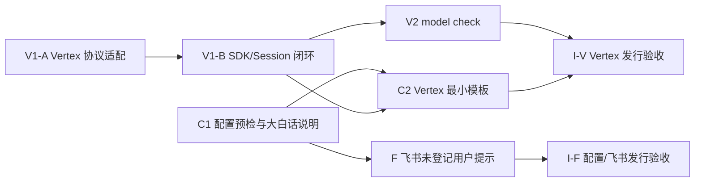

# Vertex、配置维护与飞书首次授权详细实施计划

> **For agentic workers:** REQUIRED SUB-SKILL: Use `superpowers:executing-plans` to implement this plan task-by-task. 本任务由独立开发者串行实施；每个切片先写可观察行为的失败测试，再做最小实现，并以精确 SHA 接受独立审查。

**Goal:** 在不改变现有权限、治理和数据边界的前提下，让小维支持 Vertex Express Mode API Key；让首次部署者能看懂并安全维护 `.env` / `xiaowei.json`；让未登记的飞书单聊用户从机器人取得自己的 `open_id`。

**Architecture:** 保留 `Application → OpenAI Agents SDK Runner → GovernedTools → Evidence/Session` 主链。Vertex 只新增公开 `Model` 接口的非流式协议适配器；配置继续采用操作者持有的 `.env` 与标准 JSON；未登记飞书用户在 `ChannelService.accept` 之前走固定提示和进程内限频。两条交付路径独立：`C1 → F → I-F`（配置/飞书）与 `V1 → V2 → C2 → I-V`（Vertex）。

**Tech Stack:** Python 3.11、openai-agents 0.22.3、Pydantic 2、现有 `httpx2` 受控传输、SQLAlchemy/asyncpg、PostgreSQL 16、lark-channel-sdk 1.4.0；不新增 `google-genai` 生产依赖。

**Plan status:** 候选 v1；本提交只包含设计状态与详细计划，产品源码和测试未修改。

**Spec:** 唯一详细设计为 [`2026-10-06-vertex-config-feishu-onboarding-design.md`](../specs/2026-10-06-vertex-config-feishu-onboarding-design.md)，经条件复审后文字修正版为 `2adfedef508de9c7b6cfe539744e50eb8531467b`；设计基线为 `64180239549d43a8c16994babc3ad794b1d0511a`。产品边界继续引用 [`ARCHITECTURE.md`](../../../ARCHITECTURE.md)，本文只把设计拆成可执行、可验证的任务，不重写产品背景。

**Protocol references:** Vertex Express Mode 的 `generateContent` 固定入口、请求字段、函数调用、结构化输出和 thought signature 规则，以实施时重新核对的 Google 官方资料为准：[`publishers.models.generateContent`](https://cloud.google.com/vertex-ai/generative-ai/docs/reference/express-mode/rest/v1beta1/publishers.models/generateContent)、[Function calling](https://cloud.google.com/vertex-ai/generative-ai/docs/multimodal/function-calling)、[GenerationConfig](https://cloud.google.com/vertex-ai/generative-ai/docs/reference/rest/v1beta1/GenerationConfig)、[Thought signatures](https://cloud.google.com/vertex-ai/generative-ai/docs/thought-signatures)。文档变化或真实响应与 fixture 不同，先停在对应 Gate，不在实现里猜测兼容。

## Global Constraints

- SDK 是唯一 Agent Loop。Vertex 适配器只做 SDK 输入输出与供应商 REST 的双向映射，不执行工具、不重建循环、不调用 SDK 私有 API、不 monkey patch。
- 权限不变。未登记飞书用户只能看到该可信事件里的本人 `open_id`；无模型、工具、历史、Evidence 或 StarRocks 权限。指定群继续独立按 `group.tools` 授权。
- 数据边界不变。模型正文、工具结果、凭据和原始上游错误不进入 CLI、日志或新缓存；thought signature 只作为有界 opaque 字符串回传模型。
- 失败方向安全。无自动跨供应商 fallback、无模型重试、无结果不明时重放工具；不支持的 Vertex 组合保持未开放。
- 配置仍只有 `.env` 和 `xiaowei.json`。不增加 YAML/JSONC、管理后台、热加载、联系人权限、数据库表或新的运维服务。
- 配置/飞书与 Vertex 可以分别发布。任何一条路径通过都不能替另一条关闭真实环境验收。
- 本计划阶段不调用真实模型、飞书或公司 StarRocks，不发布镜像、不部署。实施时只有取得对应授权后才能运行真实服务 Gate。
- 当前工作树已有用户修改的 `AGENT_HANDOFF.md`。实施者必须先核对并保留该差异；最终更新 handoff 时逐段合并，不能覆盖或把未验证事实写成已通过。

## Review Focus

1. `model check` 是否只解析结构、模板占位符和模型 Key，完全不解析数据库、StarRocks、飞书秘密或 CA，也不建立这些连接。
2. Vertex 是否在同一请求中同时发送函数声明与 `responseJsonSchema`，且只接受单候选、单函数调用、完整 `STOP`；不支持时是否保持关闭。
3. call ID、函数名和 thought signature 是否在同轮、并发运行、Session 保存与跨轮回放中准确关联；是否只白名单一个字段并计入历史容量。
4. 未登记私聊是否在可信事件全部校验后、业务持久化前回复；并发限频、发送失败、关闭/drain 是否不会放大发送或进入业务链。
5. `users={}` 是否只清空单聊授权；指定群成员仍按已有 `group.tools` 运行。
6. 模板、README、OPERATIONS 和 CLI 是否使用同一命令与字段名；升级是否继续保留操作者自己的两个配置文件。
7. 协议替身、正式提示词真实样本、真实飞书与正式部署证据是否明确分层，不能用 CI 绿灯替代。

## 1. 依赖顺序与交付单元



- `C1 → F → I-F` 不依赖 Vertex，可以先形成独立候选。
- `V1-A → V1-B → V2 → C2 → I-V` 必须依次关闭协议、SDK、Session、CLI、模板和真实模型 Gate。
- 每个标为审查 Gate 的切片形成一个精确候选 SHA。普通文案可并入承载其事实的切片，不另造平行计划。

## 2. C1：通用配置预检与维护说明

**可独立验证的结果：** 操作者能分清必填、按需、只生成一次和只填密码；仓库模板未替换时，`serve` 与 `config check` 在任何外部 I/O 前拒绝；飞书单聊名单可以为空，但已登记用户必须具有非空 grant。

**Files:**

- Modify: `src/xiaowei/config.py`
- Modify: `src/xiaowei/runtime.py`
- Modify: `src/xiaowei/cli.py`
- Modify: `tests/sdk_core/test_runtime.py`
- Modify: `tests/sdk_core/test_cli.py`
- Modify: `deploy/.env.example`
- Modify: `deploy/OPERATIONS.md`
- Modify: `tests/security/test_docs_command_consistency.py`
- Modify: `tests/contract/test_doc_fact_binding.py`（仅当现有事实绑定受影响）

### Step 1：先固定空名单与授权映射行为

在 `test_runtime.py` 增加以下失败测试：

- `test_empty_feishu_users_without_group_is_valid`
- `test_empty_feishu_users_with_group_keeps_group_tools_valid`
- `test_registered_feishu_subject_requires_nonempty_grant`
- `test_registered_feishu_subject_must_exist_in_grants`
- `test_feishu_grant_error_names_subject_but_not_open_id`

先运行：

```bash
uv run --locked --extra dev python -m pytest \
  tests/sdk_core/test_runtime.py -k 'empty_feishu_users or registered_feishu_subject' -q
```

预期：空名单因 `min_length=1` 失败；缺/空 grant 未按新契约拒绝，测试红灯原因与目标行为一致。

### Step 2：实现最小配置契约

- 删除 `FeishuConfig.users` 的最小长度限制，保留 key/value 格式与 subject 唯一性。
- 在 `ServeConfig._consistent` 中逐个检查 `feishu.users.values()`：subject 必须存在于 `access.grants`，工具集合必须非空。
- 错误只写内部 subject 与固定原因，不写 `open_id`、grant 内容或秘密值。
- 不改变 `group.tools` 的已有校验，不要求群成员出现在 `users`。

重跑 Step 1；预期全部通过。

### Step 3：先固定模板占位符与零 I/O 行为

在 `test_runtime.py` / `test_cli.py` 增加失败测试：

- 仓库模板中的每个**固定已知占位符**都能返回字段路径；错误不含配置值。
- 原生 `serve`、容器 `serve`、`config check` 共用同一模板预检；在 socket、数据库引擎、StarRocks、飞书装配前退出 2。
- 填好占位符的旧 OpenAI/Gemini/DeepSeek/OpenAI-compatible 配置继续通过。
- 可选第二目标或飞书未启用时，不要求相应秘密。
- 环境变量已设置但值仍是模板占位符时，完整 `config check` 退出 2，不回显该值。
- 配置文件字节和 mtime 不变。

占位符只识别发行模板中列出的固定 marker，包括形如 `<……>` 的模板秘密和 `cli_/ou_/oc_replace...` 哨兵；不做模糊“看起来不像真实值”的猜测。

运行：

```bash
uv run --locked --extra dev python -m pytest \
  tests/sdk_core/test_runtime.py tests/sdk_core/test_cli.py \
  -k 'placeholder or config_check_is_offline or configuration_errors' -q
```

预期：正式入口当前未做统一占位符预检，新增反例先失败。

### Step 4：实现共享预检，不扩大维护命令依赖

在 `runtime.py` 增加两个窄函数：

- `validate_placeholders(config: ServeConfig) -> None`：只检查 JSON 中的固定模板 marker，不读环境、不读文件、不联网。
- 内部的“解析一个秘密引用”函数：解析指定 ref 后拒绝空值和固定秘密占位符，错误只含字段路径。

连接方式：

- `validate_config` 首先调用 `validate_placeholders`，随后保持原有“全部引用 + CA + 容器参数”检查。
- 原生与容器 `serve` 在异步运行前执行 `validate_placeholders`；容器仍执行完整 `validate_config`。
- `config check` 继续执行完整 `validate_config`。
- `storage` / `requests` 不新增与其任务无关的模型、目标占位符依赖；其既有秘密解析和安全门禁保持原状。
- V2 的 `model check` 后续只复用 `validate_placeholders` 和“解析模型 Key”，绝不调用完整 `validate_config`。

重跑 Step 3；预期通过，socket/文件写入计数为零。

### Step 5：把 `.env` 和首次安装说明改成大白话

`deploy/.env.example` 保持合法 Compose env 文件，按以下顺序写短注释：

1. 通常无需改的部署参数；
2. PostgreSQL 密码与 URL 的对应关系；
3. `XW_DIGEST_KEY` 生成命令、与数据库成对备份、升级不重建；
4. 模型 Key 与第一个 StarRocks **只填密码**；
5. 第二目标和飞书启用后才取消注释的可选秘密。

`OPERATIONS.md` 在首次安装命令前增加唯一字段表：字段、是否必填、填什么、从哪里拿、以后能否改。明确 `.env` 可用 `#` 注释，标准 JSON 不能写 `#` 或 `//`；升级保留现有 `.env` / `xiaowei.json`。

运行：

```bash
uv run --locked --extra dev python -m pytest \
  tests/security/test_docs_command_consistency.py \
  tests/contract/test_doc_fact_binding.py -q
git diff --check
```

### C1 成功、关键失败与审查 Gate

- **成功：** 空单聊名单在无群/有群两种配置中均可解析；已登记用户必须有非空 grant；完整配置检查仍为零外部 I/O。
- **关键失败：** 模板 marker、缺环境值、空值、不可读 CA、端口/停止宽限不一致退出 2，输出无值；群权限不因空单聊名单消失。
- **审查：** 针对精确 SHA 核对 `load_config → validate_placeholders/validate_config → CLI`，并做“删掉原生 serve 预检”和“允许空 grant”的变异；通过后才进入 F 或 C2。
- **建议提交：** `feat: validate operator configuration before runtime I/O`

## 3. F：飞书未登记用户返回本人编号

**依赖：** C1 通过。
**可独立验证的结果：** 合法、未登记的单聊用户收到固定身份提示；该事件不进入 ChannelService、存储、模型或工具；同一用户每 10 分钟最多尝试一次，状态有界且不持久化。

**Files:**

- Modify: `src/xiaowei/feishu.py`
- Modify: `src/xiaowei/config.py`（仅说明文字；行为已由 C1 落地）
- Modify: `tests/sdk_core/test_feishu.py`
- Modify: `examples/feishu-group.example.json`
- Modify: `deploy/OPERATIONS.md`
- Modify: `README.md`（只链接已验证操作，不复制完整说明）

### Step 1：先写合法未知单聊的成功与零业务 I/O 测试

在 `test_feishu.py` 增加：

- `test_unregistered_private_user_receives_own_open_id_without_accepting_request`
- `test_unregistered_command_uses_same_identity_notice_path`
- `test_empty_users_without_group_never_calls_channel_service`
- `test_empty_users_with_group_keeps_existing_group_path`

断言固定回复为：

```text
你还没有获得授权。你的编号是 ou_xxx，请把它发给管理员。
```

用记录型 `ChannelService`/存储/模型/StarRocks 替身断言次数均为 0；群测试只证明已有群路径仍调用一次，不把群用户加入单聊授权。

先运行：

```bash
uv run --locked --extra dev python -m pytest \
  tests/sdk_core/test_feishu.py -k 'unregistered or empty_users' -q
```

预期：未知用户仍在 `_parse` 被静默拒绝，成功用例失败。

### Step 2：调整解析结果，保持可信校验顺序

- `_parse` 先完成 event type、app、tenant、sender type、`open_id` 格式、p2p、文本类型、时间、正文编码与长度校验，再查 `users`。
- `_Message` 保存可信 `sender_open_id`；单聊 `subject_id` 允许为 `None`，群消息仍使用现有 subject/group 规则。
- `inbound()` 对 `subject_id is None` 返回 `None`。
- `_receive()` 在解析成功后、命令解析与任何 ChannelService 调用前进入身份提示分支。
- `_request` / 已授权命令路径要求非空 subject；不使用正文中的 ID。

重跑 Step 1；预期通过。

### Step 3：先写限频、并发、失败与关闭测试

增加以下反例：

- 同一 `(open_id, message_id)` 只尝试一次。
- 同一用户不同消息在 10 分钟内只尝试一次；刚过窗口可再尝试。
- 两条并发消息在发送 await 被阻塞时，只有一个取得占位并发送。
- 发送明确失败或结果未知也消耗窗口，不自动重试。
- app/tenant 错、bot、非法 ID、群聊、非文本、过期、超长、格式错误、closing 均静默拒绝。
- 容量达到固定上限后只淘汰最旧记录；缓存和日志不含原始 `open_id`。
- `drain()` 等待正在发送的身份提示落定；超时行为沿用现有 readiness 契约。

运行：

```bash
uv run --locked --extra dev python -m pytest \
  tests/sdk_core/test_feishu.py -k 'unregistered' -q
```

预期：限频/并发测试在实现前失败。

### Step 4：实现两个有界内存索引

- 复用 gateway 事件循环，不加锁、不建 task；在第一次发送 await 前同步完成“检查并占位”。
- 一个 `OrderedDict` 记录最近的 `(open_id, message_id)`，一个记录用户最近尝试时间；固定容量均为 1024，窗口固定 10 分钟，不增加配置项。
- 占位后才调用现有 `_notify` / 发送超时路径；任何发送结果都不释放占位。
- 日志只写 `unregistered` 或固定异常类型，不插值身份、chat、正文。
- 状态随进程退出，不新增 schema、清理命令或备份步骤。

重跑 Step 3 与现有群/单聊/生命周期测试。

### Step 5：更新唯一操作说明与片段

- `examples/feishu-group.example.json` 的 `users` 改为 `{}`。
- `OPERATIONS.md` 说明：空 `users` 只代表单聊无人获权；配置了指定群时，群成员仍按 `group.tools` 使用。
- 写明用户取得编号后，管理员必须同时补 `feishu.users[open_id]` 与 `access.grants[subject]`，运行 `config check`，再重启。
- README 只链接该流程，不复制字段表。

运行：

```bash
uv run --locked --extra dev python -m pytest \
  tests/sdk_core/test_feishu.py \
  tests/security/test_docs_command_consistency.py \
  tests/contract/test_doc_fact_binding.py -q
uv run --locked --extra dev ruff check src/xiaowei/feishu.py src/xiaowei/config.py tests/sdk_core/test_feishu.py
uv run --locked --extra dev mypy src/xiaowei
git diff --check
```

### F 成功、关键失败与审查 Gate

- **成功：** 合法未知私聊收到本人编号；登记并重启后走原授权链；有群配置时群成员路径不回归。
- **关键失败：** 不可信/不合规事件不回复；并发/失败不放大发送；所有未知用户消息的业务调用数为 0。
- **审查：** 变异 `_receive` 让未知命令进入 `_command/_accept`、把限频占位移到 await 后、取消 group 对照，测试都必须明确失败。
- **建议提交：** `feat: return bounded Feishu onboarding identity notice`

## 4. I-F：配置与飞书候选发行验收

**依赖：** C1、F 的精确 SHA 均通过审查。
**结果：** 不依赖 Vertex，现有 Provider 的候选镜像可以用空单聊名单启动，按唯一说明完成“取得编号 → 登记权限 → 检查 → 重启 → 原有受治理入口”。

**Files:**

- Modify as needed: `tests/deployment/test_release.py`
- Modify as needed: `tests/deployment/test_compose.py`
- Modify: `deploy/OPERATIONS.md`
- Modify: `AGENT_HANDOFF.md`（保留并合并既有用户修改）

### 验收步骤

1. 以已支持的非 Vertex Profile 构建候选镜像；逐层检查仍不包含根文档、`docs/`、项目 `tests/` 和开发依赖。
2. 用 `users={}`、无群配置启动：配置检查与 serve 成功；所有合成单聊事件都不进入 `ChannelService.accept`。
3. 用 `users={}`、有效群配置启动：未知单聊零业务调用；已确认群成员 @ 机器人仍走现有群路径。
4. 用飞书发送替身验证固定提示、限频、失败与 drain；替身不证明真实平台权限或实际送达。
5. 演练保留旧 `.env` / JSON / 镜像：新镜像先 `config check`，失败时旧服务不停止；成功后才重建应用容器；回退恢复旧 JSON 与旧镜像。
6. 获得真实飞书授权后，仅用一个未登记同租户账号做一次真实私聊，再登记非空 grant 并重启；分别记录“提示发送成功”和“原已授权链成功”，不保存 open_id 到证据文档。

最少检查：

```bash
uv run --locked --extra dev python -m pytest tests/sdk_core/test_feishu.py -q
uv run --locked --extra dev python -m pytest \
  tests/deployment/test_release.py tests/deployment/test_compose.py -q
uv run --locked --extra dev ruff check .
uv run --locked --extra dev mypy src/xiaowei
uv lock --check
git diff --check
```

**未获得真实飞书授权时：** I-F 只能标记为“离线候选通过”，真实私聊和用户体验保持打开。
**建议提交：** `docs: verify operator config and Feishu onboarding release`

## 5. V1-A：Vertex Express Mode REST 与 SDK Model 适配

**可独立验证的结果：** 使用 Agents SDK 公开 `Model` 接口，把 SDK 的非流式输入、函数声明、工具结果和 `AgentAnswer` schema 映射到固定 Vertex Express Mode `generateContent`；协议错误在交给 Runner 或工具前拒绝。

**Files:**

- Create: `src/xiaowei/vertex_model.py`
- Create: `tests/sdk_core/test_vertex_model.py`
- Modify: `src/xiaowei/model_api.py`
- Modify: `tests/sdk_core/test_model_api.py`

### Step 1：锁定 Profile 与固定协议身份

先在 `test_model_api.py` 写失败测试：

- `provider="vertex"` 只需要共同字段，不接受操作者自定义 `base_url`、`api_mode`、`output_mode`。
- 既有四种 Provider JSON 原样可读；其指纹和装配行为不变。
- Vertex 模型 ID 只允许安全路径段；空值、斜杠、查询串、片段拒绝。
- Vertex `reasoning_effort` 首版必须为 `null`，避免未经验证的 thinking 参数映射。
- 指纹包含固定 endpoint、`v1beta1-generateContent` 协议身份、模型和数据策略，不含 Key 值。

实现最小变化：

- `Provider` 增加 `vertex`。
- `ModelProfile` 只把 `base_url/api_mode/output_mode` 改为条件字段：旧 Provider 必填；Vertex 必须省略。保持一个模型类，避免引入第二套配置层级。
- 固定 endpoint：`https://aiplatform.googleapis.com/v1beta1/publishers/google/models/{model}:generateContent`。
- 固定协议版本常量进入 `profile_fingerprint`。

运行：

```bash
uv run --locked --extra dev python -m pytest \
  tests/sdk_core/test_model_api.py -k 'vertex or fingerprint' -q
```

### Step 2：先写请求映射契约测试

在 `test_vertex_model.py` 用 `httpx2.MockTransport` 和真实 `Runner` 写失败测试，逐项断言：

- 方法/URL 固定，Key 只在 `x-goog-api-key` 请求头；URL、正文、异常和日志都没有 Key。
- 请求同时包含 `tools[].functionDeclarations`、`generationConfig.responseMimeType="application/json"` 与 `generationConfig.responseJsonSchema`。
- `systemInstruction`、用户/助手文本、函数调用和 `functionResponse` 顺序稳定。
- 工具输出按当前 input 中 `call_id → name` 关联转换，不使用 Model 实例上的共享可变 map。
- 请求/响应实际读取字节上限、`trust_env=false`、无重定向、无压缩、无自动重试沿用 `_GuardedTransport`。
- `previous_response_id`、`conversation_id`、prompt、handoff、流式或非 FunctionTool 输入在当前产品路径外，收到时明确拒绝，不静默丢弃。

实现：

- `_GuardedTransport` 只泛化两点：可信认证头名/值、成功响应验证器；现有四类 Provider 的请求头和 Chat 完整终态保持原样。
- `VertexModel(Model)` 实现公开 `get_response`；`stream_response` 返回明确失败的异步迭代器。
- 只映射当前产品实际使用的 function tools；不支持的 SDK Tool 类型受控拒绝。
- 不导入 `google-genai`，不调用 OpenAI SDK 私有转换器。

运行：

```bash
uv run --locked --extra dev python -m pytest tests/sdk_core/test_vertex_model.py -q
```

### Step 3：先写响应、call ID、签名和终态测试

测试至少覆盖：

- 单一文本 Part → SDK output message；usage 只取已知整数计数。
- 单一 functionCall → 非空唯一 UUID call ID、函数名/JSON 参数、`provider_data.thought_signature`。
- 后续 functionCall output 依据 input 中同一 call ID 还原正确函数名；相邻两个并发 Runner 使用相同工具名时不串线。
- 未知工具、非对象参数、缺/错 signature、多个 candidates、一个 candidate 多个 functionCall、文本和 functionCall 混合、未知 Part、缺失/未知 finishReason、非 `STOP` 均拒绝。
- 401/403、429、5xx、超时、取消、非法 JSON、压缩、响应超限为固定异常；0 次自动重试。
- 多函数调用在生成任何 SDK tool output item前失败，因此工具执行列表为空。

实现时：

- Vertex 没有稳定 call ID 时用 `uuid.uuid4()`；唯一性由每次响应生成，不依赖全局递增状态。
- 只接受一个 candidate 和完整 `STOP`。
- functionCall 必须带非空 thought signature；作为原调用 Part 的 opaque 数据返回 SDK。
- 一次多调用直接失败，不部分执行。

### Step 4：Runner 工具往返与强制结构化最终回答

用真实 `Runner`、一个进程内合成 function tool、`AgentAnswer` output type 做两次脚本化 Vertex 响应：

1. 第一次返回单一 functionCall；
2. 第二次在看见原 functionCall + signature + functionResponse 后返回符合 `AgentAnswer` 的 JSON。

断言同一请求形状持续包含工具声明和 `responseJsonSchema`，工具恰好执行一次，最终 `AgentAnswer` 类型有效。删除工具声明、删除 schema、删除 signature、改成多调用等变异必须失败。

运行：

```bash
uv run --locked --extra dev python -m pytest \
  tests/sdk_core/test_vertex_model.py tests/sdk_core/test_model_api.py -q
uv run --locked --extra dev ruff check src/xiaowei/model_api.py src/xiaowei/vertex_model.py \
  tests/sdk_core/test_model_api.py tests/sdk_core/test_vertex_model.py
uv run --locked --extra dev mypy src/xiaowei
```

### V1-A 成功、关键失败与审查 Gate

- **成功：** 真 Runner 在协议替身上完成一次工具往返和强制类型化回答；现有 Provider 回归通过。
- **关键失败：** 非完整终态、多个调用、签名/关联异常在工具 I/O 前失败；已执行工具后的第二次模型失败不重跑工具。
- **审查：** 重点检查是否只用公开 Model 接口、transport 泛化是否改变旧 Provider、并发时是否共享调用映射。
- **建议提交：** `feat: add guarded Vertex express model adapter`

## 6. V1-B：PolicySession 的最小签名白名单与正式应用闭环

**依赖：** V1-A。
**可独立验证的结果：** Vertex function call 的 thought signature 在同轮和跨用户轮回放中原样保留，其他 provider payload 不持久化；Profile 不一致时在模型 I/O 前拒绝。

**Files:**

- Modify: `src/xiaowei/session.py`
- Modify: `tests/sdk_core/test_session_policy.py`
- Modify: `tests/sdk_core/test_gate0.py`
- Modify: `tests/sdk_core/gate0.py`
- Modify: `tests/sdk_core/test_runtime.py`
- Modify: `src/xiaowei/app.py`（只抽取共享安全 RunConfig 工厂）

### Step 1：先写 Session 签名保存与拒绝测试

在 `test_session_policy.py` 增加：

- `provider_data={"thought_signature": "..."}` 随 function call 保存并原样回放。
- `provider_data` 非字典、缺字段、多字段、空字符串、非字符串、非法 UTF-8 或 UTF-8 超过 65,536 字节时拒绝整轮，不截断、不静默删除。
- 以现有 Gemini Profile 指纹保存带 `provider_data.thought_signature` 的调用时同样原样回放；没有该字段的 Gemini/DeepSeek/OpenAI 既有回放保持不变。
- 签名字节计入 `_size` 和 `max_history_bytes`；仅因加入签名越界时返回现有“历史过大”行为。
- Profile 指纹不一致时不回放签名，且模型调用次数为 0。
- 篡改持久化签名后回放失败；不把签名放进 Evidence、工具结果、Web/飞书投影或日志。

先运行：

```bash
uv run --locked --extra dev python -m pytest \
  tests/sdk_core/test_session_policy.py -k 'signature or provider_data or profile' -q
```

预期：当前 `_function_call` 丢弃额外字段，保存/回放用例先失败。

### Step 2：实现单字段白名单

- `_function_call` 仅接受可选的 `provider_data.thought_signature`；存在时进行类型、非空、UTF-8 和 65,536 字节检查。
- 未知 provider_data key 直接拒绝，避免供应商 payload 随历史扩张。
- 回放仍使用公开 SDK function call item；`_size` 对序列化后的完整项目计数，不另建计数器。
- 规则不按 Provider 分支，因此任何现有 Provider 产出同名字段都会受同一约束；Profile 指纹仍决定会话能否回放。

重跑 Step 1 和整个 `test_session_policy.py`。

### Step 3：正式 Application + 隔离 PostgreSQL 闭环

复用现有 `tests/sdk_core/gate0.py`、生产 `_instructions`、GovernedTools、Evidence 与隔离 PostgreSQL，不建第二个 live harness：

- 新增 Vertex 协议脚本端点，完成查询工具调用、最终引用、下一轮追问。
- 第二轮第一个模型请求必须包含上一轮 function call 的 signature；删除签名的变异返回 400，且工具不重跑。
- 应用仍用 `RunConfig(tracing_disabled=True, trace_include_sensitive_data=False)`；把它抽成 `safe_run_config() -> RunConfig`，Application 与 V2 共享同一工厂。
- 正式应用的工具预算、Evidence 最终校验、Session commit 和 profile binding 不因 Vertex 分支变化。

运行：

```bash
uv run --locked --extra dev python -m pytest \
  tests/sdk_core/test_gate0.py tests/sdk_core/test_session_policy.py \
  tests/sdk_core/test_runtime.py -q
```

### V1-B 成功、关键失败与审查 Gate

- **成功：** 真实 SDK/Runner/PolicySession/隔离 PG 跑通两轮，签名与 call ID 关联正确，工具和 Evidence 行为不变。
- **关键失败：** 超长/篡改/未知 provider payload、Profile 改变、回放缺签名均在未授权 I/O 前拒绝。
- **审查：** 做“从 `_function_call` 删除 provider_data”“容量不计签名”“Profile 不同仍回放”三个变异，测试必须失败。
- **建议提交：** `feat: preserve bounded model call signatures in sessions`

## 7. V2：正式 `xiaowei model check`

**依赖：** V1-B。
**可独立验证的结果：** 操作者只提供一份完整结构的 JSON 和模型 Key，就能验证当前 Profile 的真实模型协议、一次合成工具调用和最终类型；无需数据库、StarRocks、飞书变量或 CA。

**Files:**

- Modify: `src/xiaowei/cli.py`
- Modify: `src/xiaowei/runtime.py`
- Modify: `src/xiaowei/app.py`（复用 V1-B 的 `safe_run_config`）
- Modify: `tests/sdk_core/test_cli.py`
- Modify: `tests/sdk_core/test_runtime.py`
- Modify: `deploy/OPERATIONS.md`

### Step 1：先锁定 CLI、配置和零业务 I/O

增加测试：

- `xiaowei --config ... model check` 出现在 console/module 两个正式入口帮助中。
- 缺少 `XW_DATABASE_URL`、`XW_DIGEST_KEY`、所有 StarRocks 密码和飞书 Secret 时仍能进入模型替身；不可读 StarRocks CA 也不影响此命令。
- 缺/空/模板值的模型 Key 退出 2；JSON 结构或固定占位符错误退出 2。
- 测试把 `validate_config` 替换成“被调用就失败”，证明 `model check` 不调用它。
- socket 守卫只允许注入的模型 `MockTransport`；数据库 engine、StarRocks、飞书和文件写入函数调用数为 0。
- 成功输出只含 profile/model/`valid`；失败只含固定类别，无提示、响应、工具结果或 Key。

先运行：

```bash
uv run --locked --extra dev python -m pytest \
  tests/sdk_core/test_cli.py tests/sdk_core/test_runtime.py -k 'model_check' -q
```

预期：命令尚不存在，先失败。

### Step 2：实现窄模型检查装配

新增窄入口，例如 `runtime.check_model(config, *, transport=None) -> None`，只执行：

1. `load_config` 已完成的 Pydantic 结构检查；
2. `validate_placeholders(config)`；
3. 只解析 `model.api_key_ref` 的 `validate_model_config(config)`；
4. 同一个 `open_model`、`settings_for` 与 `safe_run_config()`；
5. 一个进程内无 I/O function tool 和固定合成输入；
6. `Runner.run`，无 Session、Evidence、Application、数据库或渠道。

工具必须恰好调用一次。最终结果除了 Pydantic 类型正确，还要直接断言 advice 分支：

```text
evidence_ids == ()
inferences == []
clarification is None
advice 是非空字符串
```

这里不调用 `EvidenceStore.validate_answer`，也不把一个形状正确但混用分支的回答判为通过。

### Step 3：失败分类和正式命令行为

- 参数/配置/模型 Key 问题：退出 2。
- 鉴权、429、超时、5xx、模型未调用工具、调用两次、错误工具、最终类型/分支错误：退出 1。
- 成功：退出 0。
- `config check` 继续完全离线；`model check` 明确产生模型调用和用量。
- 关闭模型客户端沿用现有有界路径，关闭失败不误报成功。

运行：

```bash
uv run --locked --extra dev python -m pytest \
  tests/sdk_core/test_cli.py tests/sdk_core/test_runtime.py \
  tests/sdk_core/test_model_api.py tests/sdk_core/test_vertex_model.py -q
uv run --locked --extra dev ruff check src/xiaowei/cli.py src/xiaowei/runtime.py src/xiaowei/app.py \
  tests/sdk_core/test_cli.py tests/sdk_core/test_runtime.py
uv run --locked --extra dev mypy src/xiaowei
```

### V2 成功、关键失败与审查 Gate

- **成功：** 缺少所有非模型秘密时，协议替身上的正式 CLI 成功；advice 分支逐字段成立。
- **关键失败：** 完整 `validate_config` 被误调用、业务连接被打开、混合回答分支被接受或正文泄漏时测试失败。
- **证据边界：** 这个命令只证明合成指令/工具的模型协议与格式，不证明生产 `_instructions` 下的工具选择；后者由 I-V 单独验证。
- **建议提交：** `feat: add isolated model profile check`

## 8. C2：Vertex 最小主模板与唯一操作文档

**依赖：** C1、V1-B、V2。
**结果：** 主模板只包含一个 Vertex Profile、一个 StarRocks 目标、Web 和 `feishu: null`；首次安装只需填写文档标出的必填项。

**Files:**

- Modify: `examples/xiaowei.example.json`
- Modify: `deploy/.env.example`
- Modify: `deploy/OPERATIONS.md`
- Modify: `README.md`
- Modify: `ARCHITECTURE.md`（只写已经实现并验证的 Provider 摘要）
- Modify: template/document tests already used by C1

### 实施与验收

1. 把主 JSON 改为 `provider: "vertex"`，省略 Vertex 不允许操作者设置的 endpoint/protocol/output 字段；模型 ID 使用固定待替换 marker。
2. 只保留 `warehouse` 一个目标；第二目标与飞书只在 OPERATIONS 放局部片段，不再维护第二份完整 JSON。
3. `.env.example` 默认只保留一个 StarRocks 密码；Archive 与飞书 Secret 注释为按需。
4. OPERATIONS 给出顺序：填配置 → `config check` → `model check` → 初始化/启动；明确 `model check` 会访问模型并产生用量。
5. README 只给最短首次安装路径并链接 OPERATIONS；不复制字段表和恢复说明。
6. 用测试夹具替换所有 marker 后走正式 `load_config`/`validate_config`；原始模板必须被正式 preflight 拒绝。
7. 检查发行白名单仍只含用户所需的模板、Compose、OPERATIONS、release metadata；五份内部根文档、`docs/`、源码和项目 tests 不进入包或镜像。

运行：

```bash
uv run --locked --extra dev python -m pytest \
  tests/sdk_core/test_runtime.py tests/sdk_core/test_cli.py \
  tests/security/test_docs_command_consistency.py \
  tests/contract/test_doc_fact_binding.py \
  tests/deployment/test_release.py tests/deployment/test_compose.py -q
git diff --check
```

**建议提交：** `docs: provide minimal Vertex operator configuration`

## 9. I-V：真实 Vertex、正式提示词与发行 Gate

**依赖：** V1-A、V1-B、V2、C2 的候选 SHA 全部通过独立审查；另需真实 Vertex 调用和镜像构建授权。
**结果：** 同一精确 SHA/镜像 digest 在锁定 `gemini-3-flash-preview` 上满足协议、正式 Agent 提示词、受治理合成工具和两轮 Session 的数字门槛，再进入一个正式用户入口。

### 9.1 协议检查与正式提示词证据分开

**A. `model check` 协议组：**

- 连续运行 5 次，要求 5/5 退出 0。
- 每次恰好执行一次合成工具，最终 advice 分支有效。
- 记录 profile ID、模型 ID、代码 SHA、镜像 digest、开始时间、耗时与可得 usage；不记录 Key、提示、响应正文或工具结果。

**B. 正式 Application 组：**

复用 `scripts/gate0_real_model.py` 与 `tests/sdk_core/gate0.py`，使用生产 `_instructions`、真实 Runner、GovernedTools、隔离 PostgreSQL 和合成数据：

- 20 次独立单轮样本，至少 19/20 完整成功。
- 结构化输出、signature、call ID、工具结果关联、未知工具、非 `STOP` 等**协议/安全失败必须为 0**。
- 多函数调用出现次数上限为 **0/20**；出现一次即保持 Vertex 未开放，并单独评估统一多调用契约。
- 允许最多 1/20 为明确的瞬时 429/5xx/timeout；必须按固定错误失败、0 次自动重试、0 次工具重放，并原样计入报告，不能补跑替换该样本。
- 每个成功样本恰好执行一个获准合成工具并产生可验证 Evidence；无查询意图样本的工具执行必须为 0。

**C. 跨轮 Session 组：**

- 5 个相互独立的两轮会话，要求 5/5 成功。
- 第一轮恰好一次工具执行；第二轮回放同一 call ID/signature 并正确利用前轮 Evidence，工具是否再次执行由固定样例预期明确，不能因缺签名重放第一轮。
- 任一 400 signature 错误、Profile 错配误回放、历史容量漏算或跨会话串线都阻断开放。

### 9.2 真实协议阻断条件

以下任一发生，停止 I-V，保留已通过的 C1/F 路径：

- Express Mode API Key 不能通过固定 `x-goog-api-key` 头调用既定 `generateContent`；
- 工具声明与 `responseJsonSchema` 不能在同一请求稳定工作；
- function call signature 无法通过公开 SDK item 在同轮或跨轮保存/回传；
- 模型经常产生多函数调用，超过 0/20；
- 最终 `AgentAnswer` 只能靠提示词 JSON、放宽 schema 或绕过 Evidence 才能成功。

### 9.3 候选镜像与正式入口

1. 完成仓库 CI 必需检查、amd64 镜像构建、逐层内容检查和 Compose 预检。
2. 同一 digest 在公司服务器运行 `config check` 与 `model check`。
3. 只开放一个已有正式入口完成：用户问题 → SDK Runner → Vertex → 受治理 StarRocks 工具 → Evidence → 用户结果；Web 或已授权飞书任选其一，另一入口保持未覆盖。
4. 真实 StarRocks 只读账号、资源限制和结果边界沿用既有验收，不因模型更换扩大。
5. 回退演练恢复旧镜像和旧 JSON；`.env` 与数据库不重建，`XW_DIGEST_KEY` 不变化。切换 Profile 后使用新会话。

最少仓库检查：

```bash
uv run --locked --extra dev python -m pytest tests/sdk_core tests/p1b tests/p25 -W error -q
uv run --locked --extra dev python -m pytest tests/deployment -q
uv run --locked --extra dev ruff check .
uv run --locked --extra dev mypy src/xiaowei
uv export --frozen --no-emit-project --extra dev -o requirements-audit.txt
uv run --locked --extra dev pip-audit --strict -r requirements-audit.txt
uv lock --check
git diff --check
```

命令以实施时 CI 的真实 product-entry 为准；若仓库命令已经变化，先更新本文与 CI 的唯一事实绑定，不能引用旧绿灯。

### I-V 成功与证据边界

- **开放门槛：** A 5/5；B 至少 19/20 且协议/安全失败 0、多调用 0/20；C 5/5；同一候选正式入口成功一次。
- **替身能证明：** 请求/响应映射、错误分类、限额、Runner/Session/Evidence 调用链。
- **替身不能证明：** 公司 Key 权限、预览模型稳定性、真实飞书送达、真实 StarRocks 权限与公司网络。
- **预览模型变化：** 换模型 ID、协议或结构化输出能力时 Profile 指纹变化，必须新建会话并重新执行 A/B/C；不沿用旧样本。
- **建议提交：** `docs: record Vertex release candidate evidence`

## 10. 兼容、恢复与发布规则

- 现有 OpenAI、Gemini、DeepSeek、OpenAI-compatible Profile 保持原 JSON 结构和行为；新增条件字段不得迫使其迁移。
- 当前非空飞书名单继续有效；新的一致性校验可能揭示以前静默无权限的 subject，升级前必须先用新镜像 `config check`。
- 本次不改应用 schema。飞书提示限频重启即清空；thought signature 只进入已有 SDK Session item JSON，并受现有保留期和容量限制。
- `.env`、`xiaowei.json`、CA 和 PostgreSQL 卷仍由操作者持有；升级不得从模板覆盖。Vertex 新模板只用于首次安装或人工对照。
- 升级顺序：保留旧发行目录与镜像 → 用新镜像只读预检 → 通过后只重建应用容器 → 运行 model check → 再接受业务入口。
- 回退顺序：停止候选应用 → 恢复旧 JSON / compose / release metadata → 按旧 digest 启动；不清空数据库、不重生摘要密钥、不自动重放请求。
- 公开配置或权限契约发生变化时，先更新唯一设计/架构来源并重新审查；普通函数命名和文件拆分可在不改变行为时按实现事实调整计划。

## 11. 尚未关闭且影响正确性的疑点

| 疑点 | 关闭切片 | 未关闭时的行为 |
| --- | --- | --- |
| Express Mode endpoint、`x-goog-api-key`、工具 + `responseJsonSchema` 的真实组合 | V1-A fixture + I-V A/B | Vertex Profile 不开放 |
| Gemini 3 thought signature 是否跨轮强制、大小是否落在 65,536 字节内 | V1-B + I-V C | Vertex 会话追问不开放；若真实签名超限，先修订边界 |
| 锁定模型的单响应多函数调用频率 | I-V B，0/20 | 出现即不开放，不部分执行 |
| 正式提示词下工具选择和最终 Evidence 质量 | I-V B | `model check` 通过也不代表产品可用 |
| 未登记账号的真实飞书接收/回复权限与送达 | I-F 真实 Gate | 只标离线候选，不宣称用户已可取得编号 |
| `gemini-3-flash-preview` 的名称和能力可能变化 | 每次发布前 A/B/C | 失败即不 fallback，管理员选择新获准模型后重验 |
| 现有 Chat Completions 路径可处理多个调用，与“未验证并行”边界不完全一致 | handoff 记录，另行任务 | 本次只让 Vertex 前置拒绝，不顺手改变其他 Provider |

## 12. 最终交付与 PR 记录

每个可审查候选在 PR 中记录：

- 批准范围和对应设计/计划链接；
- base、head、merge-base 精确 SHA；
- 真实 diff 和操作者已有工作区差异；
- 实际执行的命令、结果、候选镜像 digest；
- 协议替身、真实 SDK/PG、真实 Vertex、真实飞书、正式入口、部署分别有哪些证据；
- 没有覆盖的环境和原因；
- 回退步骤和会使旧会话失效的 Profile 变化。

`AGENT_HANDOFF.md` 最终只更新当前状态、有效证据、既有 Chat Completions 多调用缺口和下一项工作；Git 保存过程，不复制本计划。独立审查必须针对精确 SHA。计划、测试全绿或审查通过均不等于获得发布、真实服务调用或公司服务器操作授权。
