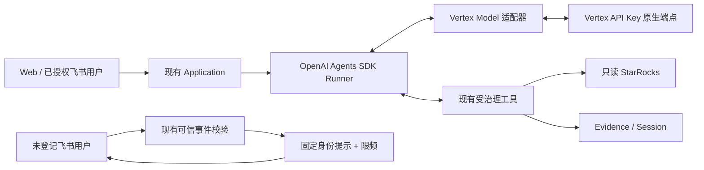
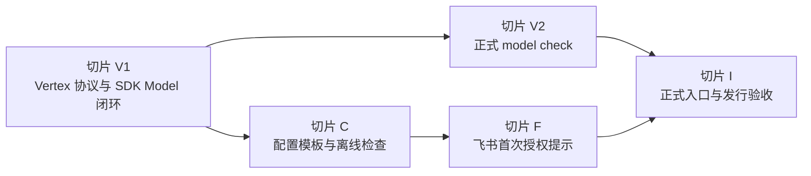

# Vertex、配置维护与飞书首次授权设计

- 状态：候选设计 v1，待用户按本文审阅
- 设计基线：`64180239549d43a8c16994babc3ad794b1d0511a`
- 批准范围：Vertex API Key 原生接入、`.env`/`xiaowei.json` 维护优化、飞书未登记用户返回本人 `open_id`
- 本阶段授权：设计、实施计划和文档；可做有边界的离线验证；不写产品功能代码

本文是上述增量的唯一详细设计。产品总边界、Agent Loop、权限、数据和证据约束继续以
[ARCHITECTURE.md](../../../ARCHITECTURE.md) 为准；协作与验证规则以
[AGENTS.md](../../../AGENTS.md) 为准。实施后只把已经成为产品事实的摘要同步到架构、README、运维
说明和 handoff，不复制本文的任务清单。

## 1. 目标与范围

本次解决三个已经在真实安装过程中出现的问题：

1. 公司模型服务使用 Vertex 原生 API Key，当前 OpenAI 协议连接器返回 403。
2. 首次部署者难以判断 `.env` 和 `xiaowei.json` 哪些字段必须填写、填什么、哪些不能在升级时重建。
3. 飞书单聊必须预先登记 `open_id`，但未登记用户当前无法从机器人取得自己的 `open_id`。

成功后的用户流程是：

```text
按模板填写配置
→ 离线检查配置
→ 显式执行一次 Vertex 模型检查
→ 启动小维
→ 未登记用户私聊取得自己的 open_id
→ 管理员登记该用户和工具权限并重启
→ 用户通过现有受治理路径查询 StarRocks
```

本次不增加管理后台、配置热加载、自动授权、联系人目录查询、多供应商路由或模型失败 fallback；
不支持 Vertex 服务账号、ADC、项目/区域认证；不改变 StarRocks 只读、Evidence、Session、渠道投影或
Web 访问边界。

## 2. 当前实现事实与复用范围

### 2.1 模型路径

当前 [`model_api.py`](../../../src/xiaowei/model_api.py) 已有以下可复用能力：

- `ModelProfile` 保存可信模型组合和安全引用，不保存凭据值；
- `open_model` 将 Profile、SDK `Model`、`ModelSettings` 和 Profile 指纹绑定为一个不可拆分的
  `ModelBinding`；
- 请求超时、请求/响应字节上限、禁用自动重试、禁用并行工具调用及固定错误类型；
- [`app.py`](../../../src/xiaowei/app.py) 使用非流式 `Runner.run` 作为唯一 Agent Loop，并将下层模型
  异常映射为固定的 `model_failed`；
- 现有工具治理、Evidence 验证、Session 过滤和最终 `AgentAnswer` 校验不依赖模型供应商。

当前连接器最终都使用 `AsyncOpenAI`，认证固定为 `Authorization: Bearer`，不能直接调用已经由公司
环境验证过的 Vertex 原生 API Key 路径。新增能力必须实现 Agents SDK 的公开 `Model` 接口，不能在
适配器中运行第二套工具循环。

### 2.2 配置路径

当前 [`runtime.py`](../../../src/xiaowei/runtime.py) 和 [`config.py`](../../../src/xiaowei/config.py) 已有：

- 标准 JSON 配置、`extra="forbid"` 和跨字段校验；
- `env:NAME` 凭据引用与不回显凭据值的错误；
- `xiaowei config check` 对配置、环境引用、本地 CA 和容器参数做零外部 I/O 的离线检查；
- `.env` 由操作者持有，`xiaowei.json` 只读挂载，升级不覆盖两者；
- 只有实际配置引用的目标密码和飞书 Secret 才需要存在。

继续保留两份配置：`.env` 保存秘密和 Compose 参数，`xiaowei.json` 保存非秘密的模型、目标、权限及
运行边界。标准 JSON 不支持注释，本次不切换 YAML/JSONC，也不在 JSON 中加入 `_comment` 等产品无关
字段。

### 2.3 飞书路径

当前 [`feishu.py`](../../../src/xiaowei/feishu.py) 已有：

- 对 app、tenant、发送者类型、`open_id`、单聊/指定群、文本、时效和长度的确定性校验；
- `open_id → subject → AccessPolicy` 的现有授权链；
- 固定提示的发送路径和进程内 `message_id` 去重；
- 未登记单聊用户在持久化、模型和工具之前被丢弃；
- 群成员、机器人身份和 @ 触发的独立边界。

事件本身已经提供发送者的可信 `open_id`，因此无需联系人目录权限、手机号/邮箱查询或 OAuth 绑定。
本次只在原有入站校验与授权拒绝之间增加一个固定的首次授权提示分支。

## 3. 方案选择

采用“现有架构内的三个薄增量”：

1. Agents SDK 公开 `Model` 接口的 Vertex 原生适配器；
2. 保持配置格式不变，通过最小模板、操作说明、占位符检查和显式模型检查降低维护成本；
3. 未登记单聊用户收到自己的 `open_id`，管理员仍通过静态配置授予权限。

不采用以下方案：

- **Vertex 前置 OpenAI 兼容代理**：会增加一个部署组件、凭据边界和故障点；
- **替换 OpenAI Agents SDK 或使用 Google 的自动工具循环**：会破坏唯一 Agent Loop 和既有治理；
- **自动把首个私聊用户写入配置或数据库**：事件身份不是权限审批，且会引入写配置、审批和恢复问题；
- **为了注释切换 YAML/JSONC**：需要新的解析边界，且不能解决秘密与非秘密分离问题；
- **管理页面与热加载**：超出当前首次部署问题，增加持续运维面。

## 4. 关键调用链



Vertex 适配器只负责协议翻译：把 SDK 输入、当前工具声明和最终输出 schema 转成 Vertex 请求；把
Vertex 文本、函数调用、usage 和结束状态转成 SDK `ModelResponse`。SDK Runner 继续决定何时调用工具，
所有实际工具调用仍经过小维治理。

未登记飞书用户不进入 `Application`，身份提示不创建请求、Session 或 Evidence，不接触 PostgreSQL、
模型或 StarRocks；唯一外部 I/O 是通过现有飞书发送路径回复固定文字。

## 5. 接口、数据、权限与失败契约

### 5.1 Vertex Model Profile

新增 `provider: "vertex"`。在本版本中它唯一表示“Vertex 原生 API Key 模式”，不泛指所有 Vertex
认证方式。公开配置保留以下共同字段：

- `profile_id`、`provider`、`model`；
- `api_key_ref`，必须为 `env:XW_MODEL_API_KEY` 一类安全引用；
- 请求期限、输出 token、请求/响应字节上限和数据策略标识。

Vertex 的官方端点、原生协议和结构化输出方式由受信代码固定，不要求操作者填写 `base_url`、
`api_mode` 或任意请求头。既有 OpenAI、Gemini、DeepSeek 和兼容 Profile 保持现有格式。Profile 指纹
必须包含 Vertex 的有效端点、协议契约版本、模型和数据策略，但不得包含 API Key 值；更换供应商、
协议或模型仍要求新会话。

适配器必须满足：

- 使用锁定版 Agents SDK 的公开 `Model` 接口；
- 非流式运行；流式接口不得伪装为已支持；
- Google 客户端自动函数调用关闭；
- 客户端自动重试关闭，不跨供应商 fallback；
- 只发送本轮 SDK 暴露的工具；模型返回未暴露工具时由现有 SDK/治理拒绝；
- 函数名、参数、调用 ID 和工具结果保持一一对应；
- 最终输出继续经过现有 Pydantic 类型和 Evidence 校验；
- 凭据、原始错误体、请求正文和模型正文不进入日志或 CLI 输出；
- 适配器不得访问 RunContext 中不存在的凭据、连接或服务。

若 Vertex 一次返回多个函数调用，不能并行执行；实现必须在任何工具 I/O 前受控拒绝该模型响应，
除非实施时先证明锁定 SDK 会按现有预算与同会话互斥串行、原子地处理它们并由独立审查接受。

### 5.2 Vertex 供应商状态与 Session

Gemini/Vertex 的函数调用可能携带下一次请求必须原样返回的 opaque signature。首片必须用协议 fixture
和获准真实模型分别判定以下两种情况：

1. 只要求同一 Runner 轮内回传；
2. 后续用户轮次回放历史函数调用时也要求回传。

若需要保存，Session 只允许保存一个有类型、长度上限和来源校验的 Vertex signature 字段；不得
保存思维文本、任意 provider payload 或凭据。该字段只供 Vertex 适配器回传，不进入模型可见工具
结果、Evidence、Web/飞书展示或日志。锁定 SDK 的公开 replay 路径不能安全保留它时，Vertex Profile
不得开放为完成状态，必须先修订设计，不能改用私有 API 或 monkey patch。

### 5.3 显式模型检查

新增操作者主动执行的 `xiaowei model check` 正式入口。它：

- 读取同一 `xiaowei.json` 和 `XW_MODEL_API_KEY`；
- 使用同一个 Vertex 适配器、SDK Runner 和最终类型校验；
- 只发送固定合成数据，提供一个进程内、无外部 I/O 的固定工具；
- 要求模型恰好调用该工具一次、收到固定结果并生成有效的结构化最终回答；
- 不连接 PostgreSQL、StarRocks 或飞书，不写 Session、请求或 Evidence；
- 明确产生一次或少量 Vertex 请求及模型用量；
- 成功只输出 Profile/模型和通过状态，失败输出固定错误类别；不输出提示、模型正文、工具结果或凭据。

退出码沿用 CLI 契约：成功为 0，模型/运行失败为 1，参数或配置错误为 2。`config check` 继续保持
完全离线，不借此命令偷偷访问 Vertex。

### 5.4 配置维护契约

[`deploy/.env.example`](../../../deploy/.env.example) 按大白话分成：

1. 通常不改的部署默认值；
2. 首次必须生成并长期保存的 PostgreSQL 密码和 `XW_DIGEST_KEY`；
3. 必填的 Vertex API Key 与第一个 StarRocks 只读密码；
4. 启用飞书或第二个目标时才填写的可选秘密。

每项说明“填值还是填引用”“从哪里取得”“能否轮换”“必须和什么一起备份”。StarRocks 环境变量只
填写密码，账号、地址和默认数据库继续写入 JSON。`XW_DIGEST_KEY` 明确与 PostgreSQL 备份成对，
升级和恢复不能重新生成。

[`examples/xiaowei.example.json`](../../../examples/xiaowei.example.json) 改为一个 Vertex Profile、一个
StarRocks 目标、Web 和 `feishu: null` 的最小有效结构；第二个目标和飞书启用方式放在运维说明的局部
片段，不维护第二份会漂移的完整配置。安全相关上限继续显式保留，不为了缩短文件隐藏边界。

模板中的待填值使用固定占位符。未经替换的仓库模板必须在 `config check` 中以字段路径和大白话原因
失败；检查只判断已知占位符，不把真实值写入错误信息。可选功能未启用时，其环境变量不得成为必填项。

[`deploy/OPERATIONS.md`](../../../deploy/OPERATIONS.md) 增加一张紧邻首次安装命令的字段表，只列：

- 必填/按需；
- 填什么；
- 去哪里取得；
- 首次生成后是否允许改；
- 常见错误和对应检查命令。

标准 JSON 不加入注释；说明中明确 `#`、`//` 会使 JSON 无法读取。内部五份开发文档、源码测试和
项目源码不进入部署发行包；用户需要的模板、运维说明、Compose 和 `release.json` 仍属于发行物。

### 5.5 飞书未登记用户契约

`feishu.users` 允许为空。启用飞书但名单为空时，服务可启动并接收事件，但没有用户获得模型或工具
权限。

对通过 app、tenant、真实用户、`open_id` 格式、单聊、纯文本、时效和大小校验的未登记发送者，回复：

> 你还没有获得授权。你的编号是 ou_xxx，请把它发给管理员。

其中 `ou_xxx` 只能取自该条可信事件的发送者字段，不能取自正文或请求参数。固定回复不包含配置、
权限详情或其他用户身份。

以下情况继续静默拒绝：

- app 或 tenant 不符；
- bot/app 发送者、缺失或非法 `open_id`；
- 群聊、非文本、过期、超长或格式错误事件；
- 服务正在关闭。

未登记用户普通私聊和任何命令都只走同一个身份提示分支；不能用 `/新建`、`/查询`、`/诊断` 等命令
越过授权。

提示使用现有发送超时和固定提示路径；发送异常或结果未知只记固定错误类型，不持久化、不自动重发。
同一 `message_id` 在进程内最多处理一次；同一 `open_id` 每 10 分钟最多成功发送一次身份提示。限频
状态有固定容量、仅在内存中存在、重启后清空，不新增数据库表或操作者配置。限频检查不得记录或输出
原始 `open_id`。

管理员授权仍需同时完成：

```text
feishu.users[open_id] = subject
access.grants[subject] = 该用户获准的工具集合
```

配置检查必须保证每个 `feishu.users` 的 subject 都存在于 `access.grants`。工具集合允许为空，以保留
只使用模型解释、不能访问 StarRocks 的最低权限用户。Web 操作者与飞书 subject 不得相同的现有规则
继续生效。修改后通过离线检查并重启服务才生效，不增加热加载。

### 5.6 统一失败契约

| 失败 | 系统行为 | 用户/操作者看到的结果 |
| --- | --- | --- |
| Vertex Key 无效或无权限 | 不 fallback、不重跑整轮 | 固定 `model_failed`；`model check` 退出 1 |
| Vertex 429、超时、5xx | 不自动重试；已执行工具不重放 | 固定模型失败，不显示上游正文 |
| Vertex 响应超限、截断、非法结构或签名缺失 | 不交给 Runner 继续；必要时本轮失败 | 固定模型失败；无伪造成功 |
| 模板字段未填写或秘密引用缺失 | 离线拒绝，不访问外部服务 | 字段路径、大白话动作和退出 2 |
| 飞书用户已登记但无 grant | 离线拒绝启动 | 指出 subject 缺少授权，不显示 `open_id` 或秘密 |
| 未登记用户身份提示发送失败 | 不保存、不重试、不进入模型 | 用户可能收不到；日志只有固定异常类型 |
| 未登记用户短时间反复发送 | 丢弃限频窗口内后续提示 | 最多每 10 分钟收到一次 |

## 6. 用户场景

| 用户操作 | 系统行为 | 用户看到的结果 |
| --- | --- | --- |
| 管理员复制模板并填写必填项 | 离线核对结构、引用、占位符和权限映射 | `configuration valid` 或准确的待修字段 |
| 管理员运行 `model check` | 经正式 SDK/Vertex 适配器完成合成工具往返 | 固定通过信息或安全失败类别 |
| 已授权用户提问 | 复用现有 Runner、治理、StarRocks 和 Evidence 链 | 正常的有证据回答 |
| 未登记用户私聊任意合法文本 | 不持久化、不调用模型或数据库；按限频回复身份 | 本人的 `open_id` 和联系管理员提示 |
| 管理员写入用户映射但漏写 grant | 配置检查在重启前拒绝 | 明确提示缺少 subject 授权 |
| 管理员补齐映射与 grant 并重启 | 用户进入现有受治理入口 | 后续私聊按获准工具范围处理 |

## 7. 实施切片与依赖顺序



### 切片 V1：Vertex 协议与 SDK Model 闭环

结果：锁定 Vertex API Key 协议和客户端依赖，新增公开 SDK `Model` 适配器，通过真 Runner 的合成工具
闭环；既有 Provider 不回归。

成功场景：普通结构化回答；一次函数调用、工具结果回传、最终结构化回答；同一会话追问。

关键失败：401/403、429、超时、5xx、响应超限、非法 JSON/schema、未知工具、多个函数调用、缺失或
错误 signature、取消和关闭超时。每项验证无自动重试、无 fallback、无秘密/正文日志；模型失败前
没有工具 I/O，工具已经执行后的模型失败不重放工具。

验收：协议级 mock、真 Runner、真实 `PolicySession` 与隔离 PostgreSQL；锁定 SDK 公共接口；验证
signature 同轮和 Session 回放。公司真实 Vertex 工具闭环证据在获得相应运行授权后补，当前离线通过
不能替代它。

### 切片 V2：正式 `model check`

结果：操作者无需数据库、飞书或 StarRocks 即可验证配置中的 Vertex 模型能完成工具往返。

成功场景：固定工具恰好调用一次，最终类型有效，CLI 退出 0 且输出无模型正文。

关键失败：未替换 Key/缺少 Key 退出 2；鉴权、限流、超时、模型未调用工具、重复调用工具或最终类型
错误退出 1；所有失败均无持久化和业务外部 I/O。

验收：CLI 级测试使用协议替身证明正式入口；真实环境只用固定合成数据运行一次，记录模型/Profile、
镜像 digest、退出码和耗时，不记录正文或 Key。

### 切片 C：配置模板与离线检查

结果：首次操作者只面对一个 Vertex、一个 StarRocks 的主模板；大白话区分必填、按需、只生成一次和
只填密码；未改模板不能误报有效。

成功场景：填好一个目标且不启用飞书/Archive 时通过；启用飞书且 `users={}` 时通过；已登记用户与
grant 成对时通过；原有合法 Provider 配置继续通过。

关键失败：模板占位符、空引用、不可读 CA、端口不一致、飞书 subject 无 grant、启用可选目标却缺少
其秘密，均在零外部 I/O 下退出 2，且不回显值。

验收：示例文件加载测试、Compose 静态检查、配置 check 无 socket/无写文件测试、发行归档白名单与
反向哨兵检查、命令和说明一致性检查。

### 切片 F：飞书首次授权提示

结果：未登记用户从自己的可信私聊事件取得本人 `open_id`，但不获得任何模型或工具权限。

成功场景：空名单服务可装配；第一个合法未知私聊收到固定提示；管理员登记并重启后，该用户走原有
受治理查询路径。

关键失败：重复 message、10 分钟内重复发送、群聊、错 app/tenant、bot、非法 ID、非文本、过期、
超限、关闭中事件和发送异常。断言请求表、Session、Evidence、模型和 StarRocks 均无调用；限频缓存
有界且不记录原始 ID。

验收：现有飞书 raw event 和发送替身的行为测试；一次真实飞书同租户私聊验证需要单独运行授权，且
只能证明身份提示与发送链，不能证明 StarRocks 查询。

### 切片 I：正式入口与发行验收

结果：同一个候选镜像中，离线配置检查、Vertex 模型检查、飞书首次授权和已授权查询路径按文档连接；
发行包不带内部文档、源码或项目测试。

成功场景：x86_64 候选镜像按最小模板部署；模型检查通过；空飞书名单启动；取得 `open_id`、登记、
检查、重启后正常进入已授权入口。

关键失败：错误 Key、未填占位符、漏 grant 和回退旧镜像分别按本文契约处理。

验收：仓库必需检查、amd64 构建与镜像内容检查、Compose 正式命令；公司 Vertex、真实飞书和真实
StarRocks 的证据分开记录，任何一项替身通过都不能代替另一项。

## 8. 环境与必要检查

实施环境继续使用仓库 Python 3.11、锁定的 `openai-agents` 0.22.x、真实 PostgreSQL 测试实例和
现有 lint/type/test 命令。新增 Vertex 客户端必须进入生产依赖和锁文件，核对许可证、依赖审计及
linux/amd64 和 linux/arm64 安装；不得借用仓库外 Python 环境宣称通过。

最低验证层级：

1. **静态/离线**：Profile、配置、协议映射、限额、权限和飞书拒绝分支；网络默认禁止。
2. **协议替身**：Vertex HTTP 形状、函数调用、signature、错误与限额；飞书 raw event 和发送结果。
3. **真实 SDK/存储**：真 Runner、受治理合成工具、PolicySession、隔离 PostgreSQL。
4. **真实 Vertex**：固定合成任务与工具闭环，不含公司数据。
5. **真实入口**：飞书身份提示、已授权用户和只读 StarRocks，分别留下证据。
6. **发行**：amd64 镜像、发行归档、Compose、配置保留和回退。

当前授权只覆盖第 1–3 层中的离线部分。第 4–6 层需要使用真实服务或发布候选时沿用或取得相应授权。

## 9. 兼容、升级与恢复

- 现有 OpenAI、Gemini、DeepSeek 和 OpenAI-compatible 配置继续读取；不强制迁移到 Vertex。
- 现有非空飞书名单继续有效；新增 subject/grant 一致性可能暴露以前静默失败的错误配置，升级前先运行
  新镜像的 `config check`。
- 本次不改应用数据库 schema；飞书限频不持久化。
- `.env` 和 `xiaowei.json` 继续由操作者持有，升级不得用模板覆盖。
- 切换到 Vertex 会改变 Profile 指纹，操作者必须新建会话；旧历史保留到原有保留期，但不迁移给新的
  模型接收方。
- 升级前保留旧镜像、旧 `compose.yaml`、`release.json` 和配置副本。回退旧镜像时恢复旧 JSON；旧版
  可能不认识 `provider: vertex` 或空 `feishu.users`。新增 `.env` 变量可保留，但不应依赖旧版忽略未知
  配置的行为来替代回退验证。
- Vertex 或飞书失败不影响 PostgreSQL 备份格式；现有 `XW_DIGEST_KEY` 与数据库成对恢复规则不变。

## 10. 影响正确性的待验证问题

以下问题不交给普通实现细节决定，必须在对应切片关闭：

1. **Vertex 客户端控制能力**：选定的 Google 官方客户端版本能否通过公开 API 同时固定 Vertex API
   Key 模式、关闭自动工具循环/重试/环境代理、实施请求期限与请求/响应字节上限。若不能，须在 V1
   开工前决定使用受控的现有 HTTP transport 还是修订设计，不能静默放宽。
2. **Vertex signature 回放**：`gemini-3-flash-preview` 是否要求函数调用 signature 跨用户轮次保存；
   锁定 Agents SDK 和现有 `PolicySession` 是否能通过公开 replay 项安全保留固定字段。该问题未关闭
   前不能宣称会话追问可用。
3. **真实模型组合**：已有 `VERTEX_NATIVE_OK` 只证明基础文本请求；工具声明、工具结果回传、结构化
   最终输出和用量字段仍缺真实证据。
4. **真实飞书发送**：现有 SDK 代码证明事件含发送者 `open_id`，但当前项目尚未用真实未登记账号验证
   “接收已 ack 后回复固定提示”的权限与发送结果。

这些问题的失败方向都是保持功能未开放或受控失败，不通过增加权限、自动 fallback、吞异常或跳过
Session/Evidence 校验来解决。

## 11. 文档与审查版本

本文通过用户审阅后再编写独立实施计划；实施计划引用本文，不复制产品背景。开工前独立审查至少核对：

- 本文提交 SHA 和基线 `64180239549d43a8c16994babc3ad794b1d0511a`；
- `ARCHITECTURE.md` 的唯一 Agent Loop、静态 Profile、Session、权限和数据边界；
- `model_api.py`、`runtime.py`、`app.py`、`feishu.py`、`config.py`、`cli.py` 的真实调用链；
- 计划是否为第 10 节问题设置了阻断性证据。

审查通过只批准按计划开工，不代表 Vertex、真实飞书、公司 StarRocks、镜像发布或公司服务器部署已完成。
